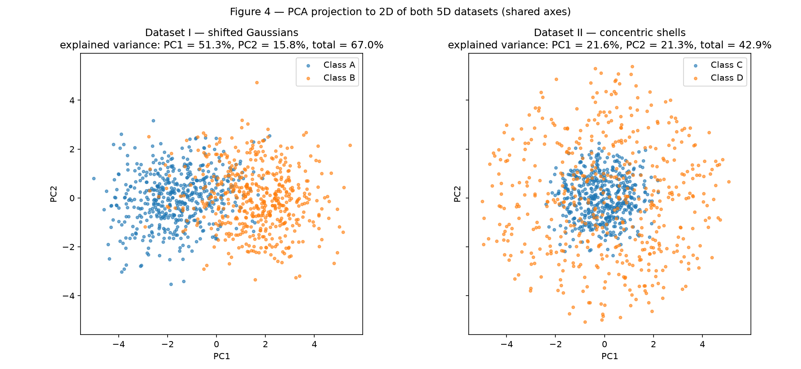
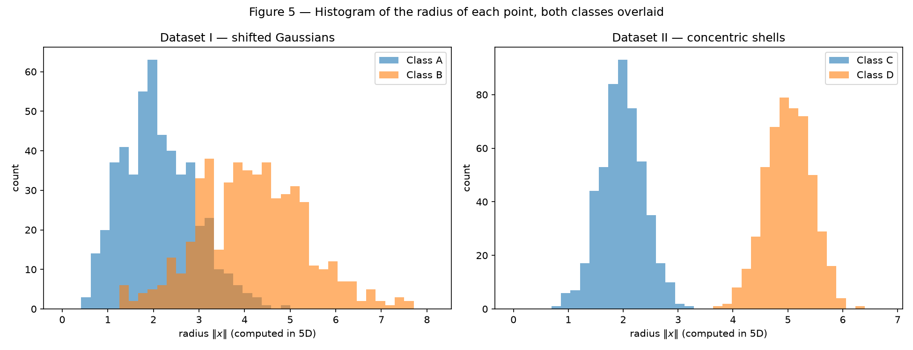

# Data — Preparation and Analysis for Neural Networks

Data preparation and analysis for neural networks. Every script in this activity fixes the random seed with `rng = np.random.default_rng(42)` and consumes the generator in a fixed, documented order, so every number and figure below is exactly reproducible.

## Exercise 1

### A — Generate the clouds

I generated 400 samples divided equally among 4 classes (100 samples each), drawing each class from a 2D Gaussian with the parameters given in the statement:

| Class | Mean | Standard deviation |
|---|---|---|
| 0 | [2, 3] | [0.8, 2.5] |
| 1 | [5, 6] | [1.2, 1.9] |
| 2 | [8, 1] | [0.9, 0.9] |
| 3 | [15, 4] | [0.5, 2.0] |

The generator is created once with seed 42 and consumed in a fixed order (the four scaled datasets of item B, from s = 0.5 to s = 4.0), so the s = 1.0 dataset shown in Figure 1 is always the same.


/// caption
Figure 1 — The four point clouds at s = 1.0, one color per class, with each class mean marked with a black X.
///

### B — More or less spread out

The same 4 classes were generated four times over, multiplying all standard deviations by the scale factor s ∈ {0.5, 1.0, 2.0, 4.0} — the means never change, only the spread. Figure 2 shows the four datasets with shared axis limits, so the growth of the overlap is directly comparable.


/// caption
Figure 2 — The same four classes under s ∈ {0.5, 1.0, 2.0, 4.0}, with shared axis limits.
///

**Separation ratio (s = 1.0).** For each pair of classes, r_ij = ‖μ_i − μ_j‖ / (σ̄_i + σ̄_j), with σ̄_k the average of the two axis standard deviations of class k (σ̄_0 = 1.65, σ̄_1 = 1.55, σ̄_2 = 0.90, σ̄_3 = 1.25):

| Pair (i, j) | ‖μ_i − μ_j‖ | σ̄_i + σ̄_j | r_ij |
|---|---|---|---|
| (0, 1) | 4.243 | 3.20 | **1.326** |
| (0, 2) | 6.325 | 2.55 | 2.480 |
| (0, 3) | 13.038 | 2.90 | 4.496 |
| (1, 2) | 5.831 | 2.45 | 2.380 |
| (1, 3) | 10.198 | 2.80 | 3.642 |
| (2, 3) | 7.616 | 2.15 | 3.542 |

The smallest ratio is **r_01 = 1.326** — classes 0 and 1 are the closest pair relative to their spreads, which matches the visible contact between the blue and orange clouds in Figure 1. Since the means do not change with s, r_ij scales with 1/s: at s = 2 the smallest ratio becomes **r_01 = 1.326 / 2 = 0.663**, without generating anything new.

**Mixing rate.** For each s, the fraction of points whose nearest class center (among the four means) is not the one of their own class — a purely geometric measure, nothing is trained:

| s | Mixing rate |
|---|---|
| 0.5 | 0.25% |
| 1.0 | 7.25% |
| 2.0 | 19.25% |
| 4.0 | 48.25% |


/// caption
Figure 3 — Mixing rate as a function of s. With 4 balanced classes, random assignment would give 75%.
///

**From which scale factor can the clouds no longer be separated by straight lines?** From **s = 2.0** on. At s = 1.0 the mixing rate is still 7.25% — a set of straight lines separates the classes with only a thin contaminated strip between classes 0 and 1. At s = 2.0 the mixing rate jumps to 19.25%: roughly one point in five already sits closer to another class's center than to its own, so no arrangement of straight lines can keep the classes apart — errors are no longer confined to a thin boundary strip. Exactly at that point the smallest separation ratio drops to r_01 = 0.663 < 1, meaning the distance between the two closest centers is smaller than the sum of their average spreads: the clouds interpenetrate rather than merely touch.

### C — Analysis

**Overlap at s = 1.0.** Classes 2 (green) and 3 (red) are essentially isolated: their smallest ratios towards any other class are ≥ 2.38, and Figure 1 shows clear gaps around them. The overlap is concentrated in the pair 0–1 (r_01 = 1.326): class 0 is very elongated vertically (σ_y = 2.5) and its upper tail invades the region of class 1, producing the 7.25% mixing measured above.

**Could a single linear boundary separate all classes?** No — this is impossible regardless of the data: one straight line divides the plane into only two half-planes, and we have four classes. **A set of linear boundaries?** Yes, to a good approximation at s = 1.0: the classes are arranged so that piecewise-linear frontiers (equivalently, one-vs-rest linear separators) isolate each cloud, misclassifying only the thin 0–1 contact strip.

**Sketched boundaries.** Figure 1 (annotated) below sketches the boundaries a trained network could plausibly learn, drawn as the nearest-center (Voronoi) partition of the plane — piecewise-linear frontiers, consistent with the fact that errors concentrate on the 0–1 edge:


/// caption
Figure 1 (annotated) — Sketched piecewise-linear decision boundaries (nearest-center regions) over the s = 1.0 data.
///

**Spread × inevitable-error region.** The sketched boundaries pass through the low-density valleys between clouds. As s grows, each cloud's tails cross the boundary into its neighbors' regions, and the "band of confusion" around every frontier widens — the mixing rate quantifies exactly this growth (0.25% → 7.25% → 19.25% → 48.25%). Since class-conditional distributions overlap, no decision boundary — linear or not — can avoid errors in the overlap region: a network necessarily makes mistakes there, and the size of that region grows with the spread. At s = 4.0 nearly half the points (48.25%) are already on the "wrong side" geometrically, approaching the 75% of pure chance for 4 balanced classes.

### Code

``` python
--8<-- "docs/exercises/data/code/exercise1.py"
```

## Exercise 2

### A — Dataset I: shifted Gaussians

I generated 500 samples for Class A and 500 for Class B with `rng.multivariate_normal`, using exactly the mean vectors and covariance matrices of the statement: μ_A = [0, 0, 0, 0, 0] with Σ_A (unit variances, +0.8 correlation between the first two features), and μ_B = [1.5, 1.5, 1.5, 1.5, 1.5] with Σ_B (variances 1.5, −0.7 correlation between the first two features). Before sampling, the script checks that both matrices are valid covariances: symmetric, with smallest eigenvalues 0.158 (Σ_A) and 0.498 (Σ_B), both positive.

Sanity check of the generation (sample statistics over 500 points): the sample means are [0.026, 0.085, 0.037, 0.019, 0.035] for Class A and [1.524, 1.452, 1.473, 1.519, 1.530] for Class B, and the largest absolute deviation between a sample covariance entry and its target is 0.086 (A) and 0.137 (B) — the expected sampling noise for n = 500.

### B — Dataset II: concentric shells

The second dataset also has 500 samples per class in 5 dimensions, but with radial structure. For each point I draw a direction v ~ N(0, I₅) and normalize it, u = v / ‖v‖ (uniform on the unit sphere of ℝ⁵), then draw a radius ρ ~ N(2.0, 0.4) for Class C (core) or ρ ~ N(5.0, 0.4) for Class D (shell), and set x = ρ · u. I read N(μ, 0.4) as mean μ and standard deviation 0.4, the same convention as Exercise 1. The script verifies that every direction has unit norm before scaling. The generator is consumed in the order Class A, Class B, Class C (directions, then radii), Class D (directions, then radii).

### C — Visualize and compare

**Figure 4 — PCA projection.** PCA (scikit-learn, `n_components=2`) was fitted on each complete dataset (both classes together, unsupervised) and the two projections are plotted side by side with shared axis limits and equal aspect, so the scatter plots are directly comparable.


/// caption
Figure 4 — PCA projection to 2D of Dataset I (left) and Dataset II (right), colored by class, with shared axes.
///

**Explained variance of the first two components:**

| Dataset | PC1 | PC2 | PC1 + PC2 |
|---|---|---|---|
| I — shifted Gaussians | 51.27% | 15.77% | **67.04%** |
| II — concentric shells | 21.59% | 21.32% | **42.91%** |

**In which dataset does the 2D projection better preserve the information relevant for classification?** In **Dataset I**. There, the shift of the means along (1, 1, 1, 1, 1) is the largest source of variance in the pooled data, so PC1 aligns with the direction that separates the classes and captures 51.27% of the variance on its own: in Figure 4 (left) the two classes appear as two displaced blobs. In Dataset II the distribution is isotropic — every direction carries about 1/5 = 20% of the variance (21.59% ≈ 21.32%), so PCA has no preferred direction to find and the projection is essentially arbitrary. Worse, the only information that separates C from D is the radius, and a projection to 2 coordinates discards the contribution of the other 3 coordinates to ‖x‖²: the projected shell fills a disk instead of a ring, and the core sits inside it. Quantitatively, 38.80% of the Class D points project inside the disk (radius 2.717 in the PCA plane) that contains every Class C point.

**Distance between the class centers, computed in 5D** from the sample means:

| Dataset | ‖μ₁ − μ₂‖ (sample) | Theoretical |
|---|---|---|
| I — shifted Gaussians | **3.264** | 1.5 · √5 = 3.354 |
| II — concentric shells | **0.266** | 0 (both classes centered at the origin) |

**Figure 5 — Radius histograms.** The radius ‖x‖ of every point was computed in 5D and plotted per class, both classes overlaid on the same axis, one panel per dataset:


/// caption
Figure 5 — Histogram of ‖x‖ (computed in 5D) for each class, overlaid, in Dataset I (left) and Dataset II (right).
///

Per class, the radius is 2.109 ± 0.787 (A) and 4.175 ± 1.160 (B) in Dataset I — overlapping distributions — and 1.972 ± 0.396 (C) versus 5.005 ± 0.409 (D) in Dataset II — two disjoint peaks, matching the radii 2.0 and 5.0 with standard deviation 0.4 that generated them. The two datasets are mirror images of each other: in Dataset I the classes differ by their **centers** (distance 3.264) and overlap in radius; in Dataset II the centers **coincide** (distance 0.266 ≈ 0) and the classes differ only by their radius.

### D — Analysis

**Coincident centers × separated radii → no hyperplane can separate the classes.** A hyperplane w·x + b = 0 splits ℝ⁵ into two half-spaces. Because both classes are centered at the same point (the origin) and spread symmetrically in every direction, the projection w·x of either class onto any direction w is symmetric around the same value, w·0 = 0: whatever w is, about half of Class C and half of Class D fall on each side of a hyperplane through the center. Moving the hyperplane away from the center does not help either: to leave the whole shell (radius ≈ 5) on one side, its distance from the origin |b| / ‖w‖ would have to exceed 5, but then the entire core (radius ≈ 2 < 5) lies on that same side. A linear boundary can only exploit a difference between the class **centers**, and here that difference is essentially zero (0.266), even though the radius histograms in Figure 5 (right) do not even touch. The classes are perfectly separable — just not by a hyperplane.

**Why more data cannot fix it.** This is a property of the geometry of the two populations, not of the sample: the core is (approximately) the sphere of radius 2 and the shell the sphere of radius 5 around the same center, and every half-space either contains parts of both spheres or contains both entirely. Collecting more points only fills the two spheres more densely; it never creates a direction along which the classes are displaced. In Dataset I, by contrast, the classes are displaced (distance 3.264), and a single hyperplane — the one equidistant from the two centers, i.e. the nearest-center rule — already separates 88.20% of the points in 5D (nearest-center mixing rate of 11.80%, a purely geometric measure). That is exactly the kind of boundary a Perceptron can learn; Dataset II is exactly the kind it cannot.

**Does a mixed 2D projection prove inseparability?** No. PCA is a linear transformation: it can only discard information, never create it, so overlap in the projection is a property of the projection, not of the data. My own results show this directly: in the PCA plane, 38.80% of the Class D points land inside the disk containing all of Class C (Figure 4, right), yet in the original 5D space the classes are separated with 100.00% accuracy (1000/1000 points) by the simple function below. The converse does hold: separation in a linear projection *does* prove separability in the original space, because the projection is itself a linear function of the inputs — this is what Figure 4 (left) shows for Dataset I.

**A simple function of the inputs that separates Dataset II.** Following the hint, use the squared radius:

f(x) = ‖x‖² − 3.5² = x₁² + x₂² + x₃² + x₄² + x₅² − 12.25,  predict **Class D if f(x) > 0**, **Class C otherwise**.

The threshold 3.5 is the midpoint between the two mean radii (2.0 and 5.0), 3.75 standard deviations (0.4) away from each; on the generated data this rule classifies 1000 of 1000 points correctly (100.00% accuracy). It is non-linear in x (quadratic), which is why a linear model cannot represent it — but a network with one hidden layer of non-linear units can build it, or equivalently a Perceptron becomes sufficient if the inputs are first expanded with the squared features x_i², in which f is linear.

### Code

``` python
--8<-- "docs/exercises/data/code/exercise2.py"
```

## Results summary

| # | Item | Your value |
|---|---|---|
| 1 | Mixing rate at s = 0.5 | 0.25% |
| 2 | Mixing rate at s = 1.0 | 7.25% |
| 3 | Mixing rate at s = 2.0 | 19.25% |
| 4 | Mixing rate at s = 4.0 | 48.25% |
| 5 | Smallest r_ij at s = 1.0, and which pair | r_01 = 1.326, pair (0, 1) |
| 6 | Distance between centers — Dataset I | 3.264 (sample means, 5D; theoretical 1.5·√5 = 3.354) |
| 7 | Distance between centers — Dataset II | 0.266 (sample means, 5D; theoretical 0) |
| 8 | Explained variance PC1 + PC2 — Dataset I | 67.04% (51.27% + 15.77%) |
| 9 | Explained variance PC1 + PC2 — Dataset II | 42.91% (21.59% + 21.32%) |
| 10 | Share of the positive class in Transported | *(Exercise 3 — pending)* |
| 11 | Mean and median of FoodCourt (training set, before transforming) | *(Exercise 3 — pending)* |
| 12 | Final shape of the training feature matrix | *(Exercise 3 — pending)* |
| 13 | Min and max of the training and test sets after scaling | *(Exercise 3 — pending)* |
