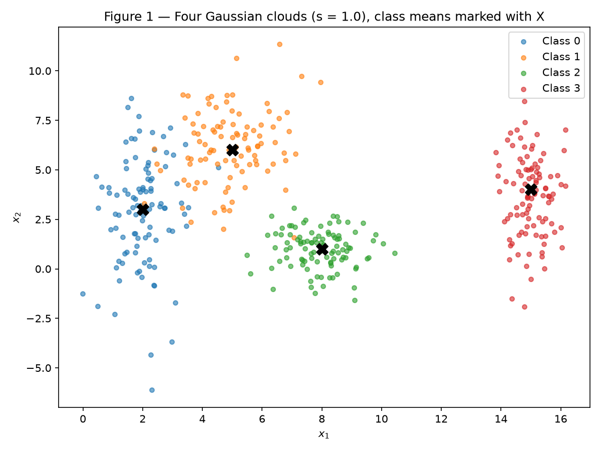
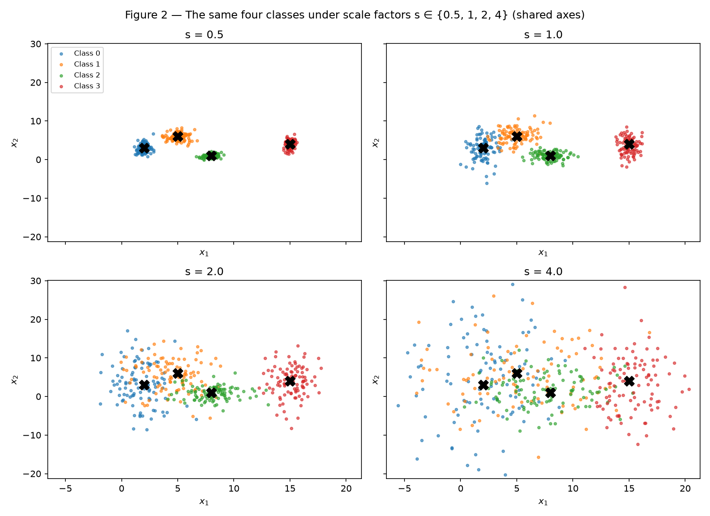
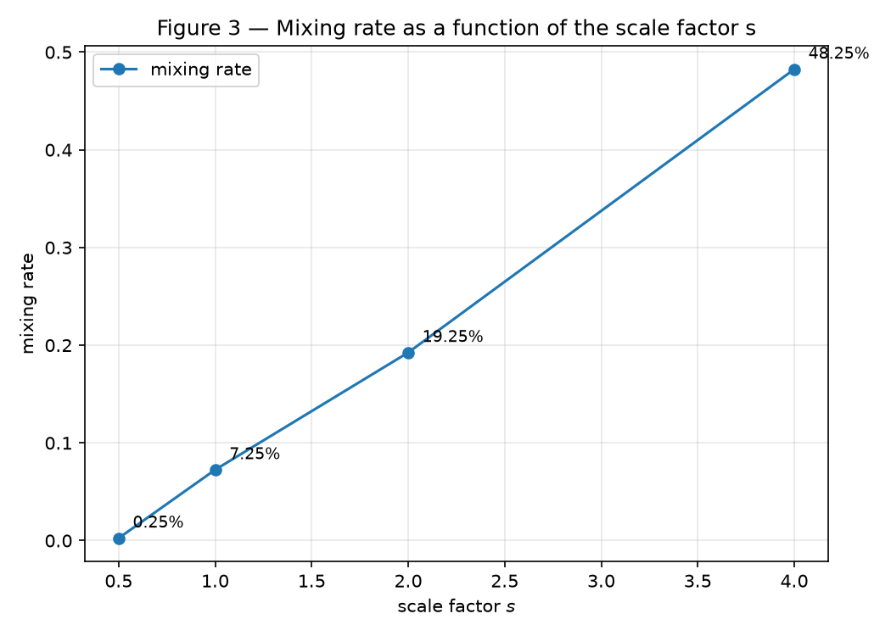
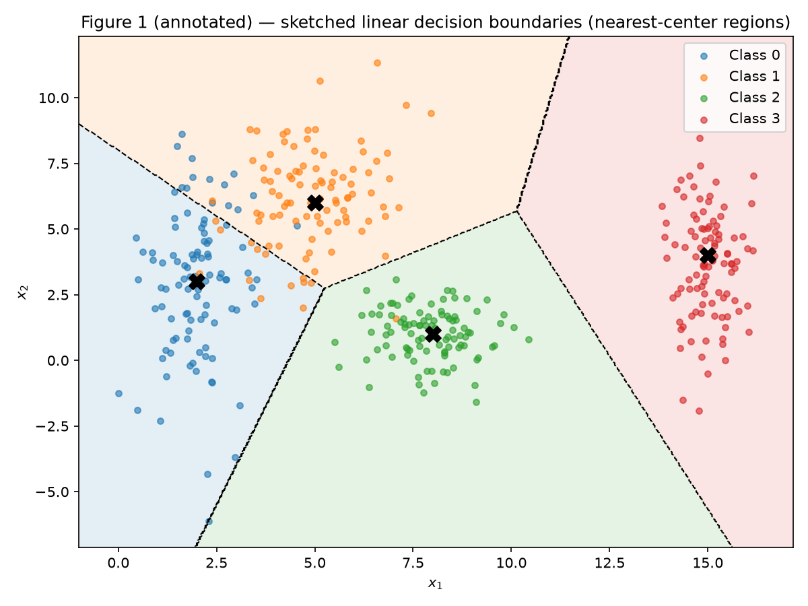

# Exercise 1 — Data

Data preparation and analysis for neural networks. All results below use a single fixed random generator, `rng = np.random.default_rng(42)`, shared across the whole activity, so every number and figure is reproducible.

## Exercise 1

### A — Generate the clouds

I generated 400 samples divided equally among 4 classes (100 samples each), drawing each class from a 2D Gaussian with the parameters given in the statement:

| Class | Mean | Standard deviation |
|---|---|---|
| 0 | [2, 3] | [0.8, 2.5] |
| 1 | [5, 6] | [1.2, 1.9] |
| 2 | [8, 1] | [0.9, 0.9] |
| 3 | [15, 4] | [0.5, 2.0] |

The generator is created once with seed 42 and consumed in a fixed order (the four scaled datasets of item B, from s = 0.5 to s = 4.0), so the s = 1.0 dataset shown in Figure 1 is always the same.


/// caption
Figure 1 — The four point clouds at s = 1.0, one color per class, with each class mean marked with a black X.
///

### B — More or less spread out

The same 4 classes were generated four times over, multiplying all standard deviations by the scale factor s ∈ {0.5, 1.0, 2.0, 4.0} — the means never change, only the spread. Figure 2 shows the four datasets with shared axis limits, so the growth of the overlap is directly comparable.


/// caption
Figure 2 — The same four classes under s ∈ {0.5, 1.0, 2.0, 4.0}, with shared axis limits.
///

**Separation ratio (s = 1.0).** For each pair of classes, r_ij = ‖μ_i − μ_j‖ / (σ̄_i + σ̄_j), with σ̄_k the average of the two axis standard deviations of class k (σ̄_0 = 1.65, σ̄_1 = 1.55, σ̄_2 = 0.90, σ̄_3 = 1.25):

| Pair (i, j) | ‖μ_i − μ_j‖ | σ̄_i + σ̄_j | r_ij |
|---|---|---|---|
| (0, 1) | 4.243 | 3.20 | **1.326** |
| (0, 2) | 6.325 | 2.55 | 2.480 |
| (0, 3) | 13.038 | 2.90 | 4.496 |
| (1, 2) | 5.831 | 2.45 | 2.380 |
| (1, 3) | 10.198 | 2.80 | 3.642 |
| (2, 3) | 7.616 | 2.15 | 3.542 |

The smallest ratio is **r_01 = 1.326** — classes 0 and 1 are the closest pair relative to their spreads, which matches the visible contact between the blue and orange clouds in Figure 1. Since the means do not change with s, r_ij scales with 1/s: at s = 2 the smallest ratio becomes **r_01 = 1.326 / 2 = 0.663**, without generating anything new.

**Mixing rate.** For each s, the fraction of points whose nearest class center (among the four means) is not the one of their own class — a purely geometric measure, nothing is trained:

| s | Mixing rate |
|---|---|
| 0.5 | 0.25% |
| 1.0 | 7.25% |
| 2.0 | 19.25% |
| 4.0 | 48.25% |


/// caption
Figure 3 — Mixing rate as a function of s. With 4 balanced classes, random assignment would give 75%.
///

**From which scale factor can the clouds no longer be separated by straight lines?** From **s = 2.0** on. At s = 1.0 the mixing rate is still 7.25% — a set of straight lines separates the classes with only a thin contaminated strip between classes 0 and 1. At s = 2.0 the mixing rate jumps to 19.25%: roughly one point in five already sits closer to another class's center than to its own, so no arrangement of straight lines can keep the classes apart — errors are no longer confined to a thin boundary strip. Exactly at that point the smallest separation ratio drops to r_01 = 0.663 < 1, meaning the distance between the two closest centers is smaller than the sum of their average spreads: the clouds interpenetrate rather than merely touch.

### C — Analysis

**Overlap at s = 1.0.** Classes 2 (green) and 3 (red) are essentially isolated: their smallest ratios towards any other class are ≥ 2.38, and Figure 1 shows clear gaps around them. The overlap is concentrated in the pair 0–1 (r_01 = 1.326): class 0 is very elongated vertically (σ_y = 2.5) and its upper tail invades the region of class 1, producing the 7.25% mixing measured above.

**Could a single linear boundary separate all classes?** No — this is impossible regardless of the data: one straight line divides the plane into only two half-planes, and we have four classes. **A set of linear boundaries?** Yes, to a good approximation at s = 1.0: the classes are arranged so that piecewise-linear frontiers (equivalently, one-vs-rest linear separators) isolate each cloud, misclassifying only the thin 0–1 contact strip.

**Sketched boundaries.** Figure 1 (annotated) below sketches the boundaries a trained network could plausibly learn, drawn as the nearest-center (Voronoi) partition of the plane — piecewise-linear frontiers, consistent with the fact that errors concentrate on the 0–1 edge:


/// caption
Figure 1 (annotated) — Sketched piecewise-linear decision boundaries (nearest-center regions) over the s = 1.0 data.
///

**Spread × inevitable-error region.** The sketched boundaries pass through the low-density valleys between clouds. As s grows, each cloud's tails cross the boundary into its neighbors' regions, and the "band of confusion" around every frontier widens — the mixing rate quantifies exactly this growth (0.25% → 7.25% → 19.25% → 48.25%). Since class-conditional distributions overlap, no decision boundary — linear or not — can avoid errors in the overlap region: a network necessarily makes mistakes there, and the size of that region grows with the spread. At s = 4.0 nearly half the points (48.25%) are already on the "wrong side" geometrically, approaching the 75% of pure chance for 4 balanced classes.

### Code

``` python
--8<-- "docs/exercises/data/code/exercise1.py"
```

## Results summary

| # | Item | Your value |
|---|---|---|
| 1 | Mixing rate at s = 0.5 | 0.25% |
| 2 | Mixing rate at s = 1.0 | 7.25% |
| 3 | Mixing rate at s = 2.0 | 19.25% |
| 4 | Mixing rate at s = 4.0 | 48.25% |
| 5 | Smallest r_ij at s = 1.0, and which pair | r_01 = 1.326, pair (0, 1) |
| 6 | Distance between centers — Dataset I | *(Exercise 2 — pending)* |
| 7 | Distance between centers — Dataset II | *(Exercise 2 — pending)* |
| 8 | Explained variance PC1 + PC2 — Dataset I | *(Exercise 2 — pending)* |
| 9 | Explained variance PC1 + PC2 — Dataset II | *(Exercise 2 — pending)* |
| 10 | Share of the positive class in Transported | *(Exercise 3 — pending)* |
| 11 | Mean and median of FoodCourt (training set, before transforming) | *(Exercise 3 — pending)* |
| 12 | Final shape of the training feature matrix | *(Exercise 3 — pending)* |
| 13 | Min and max of the training and test sets after scaling | *(Exercise 3 — pending)* |
