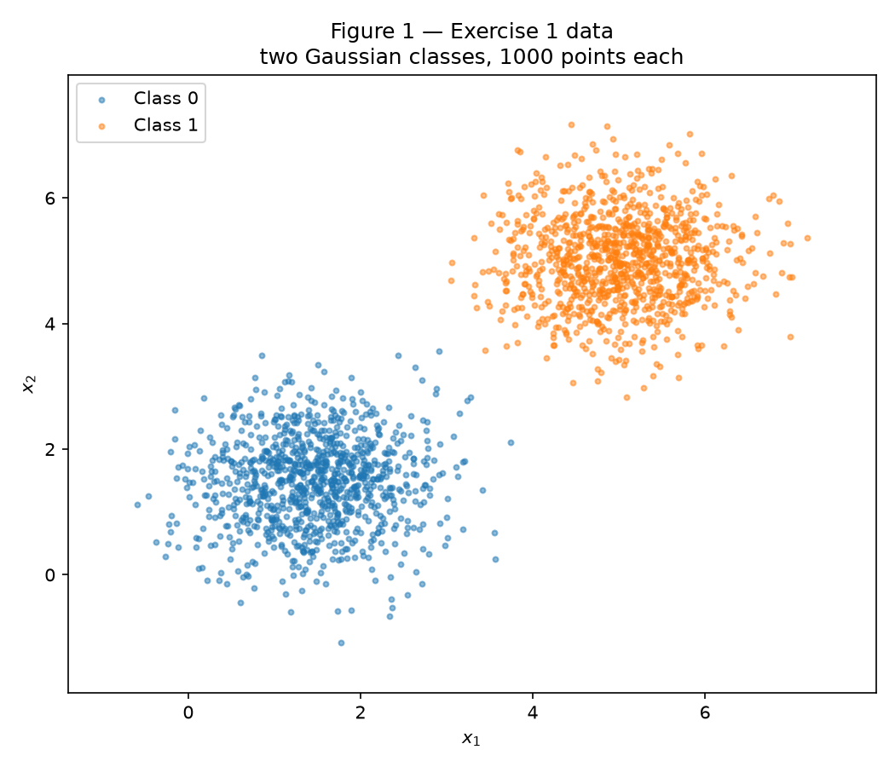
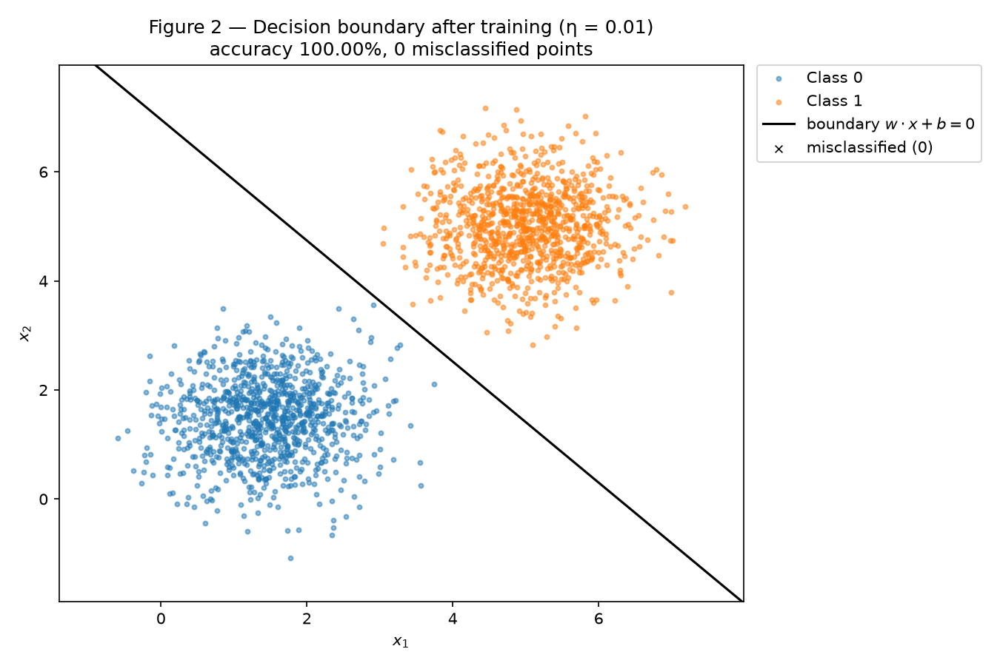
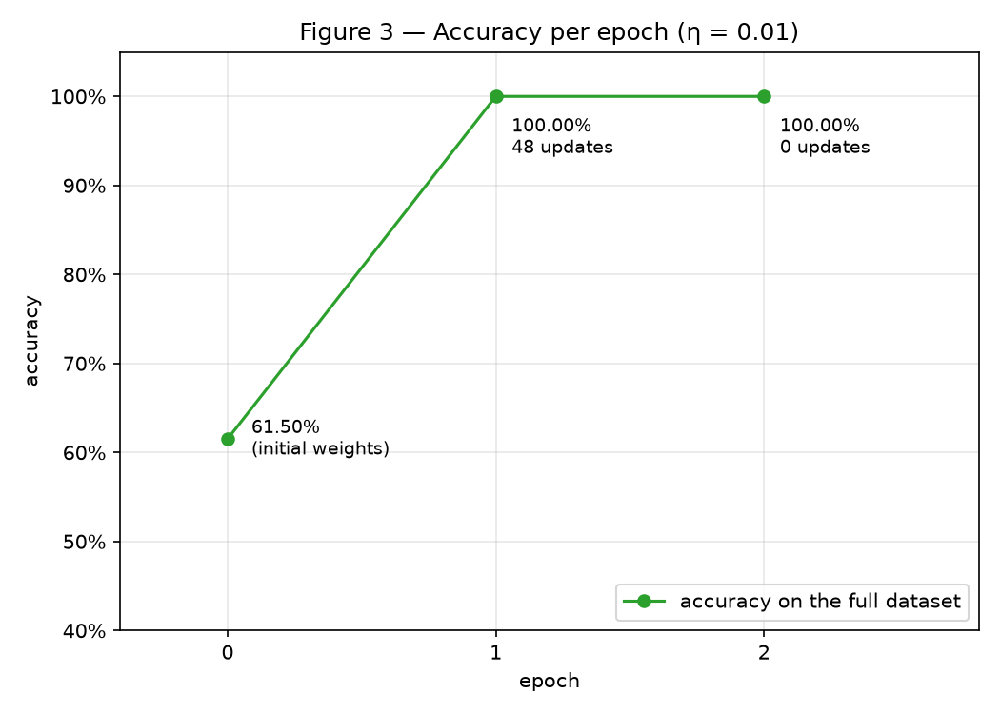
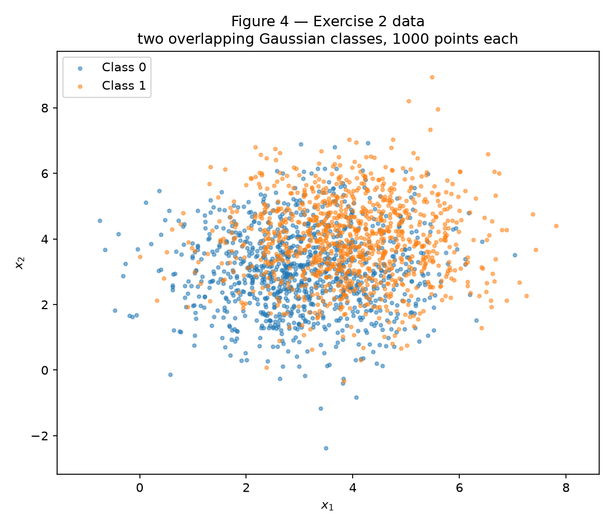
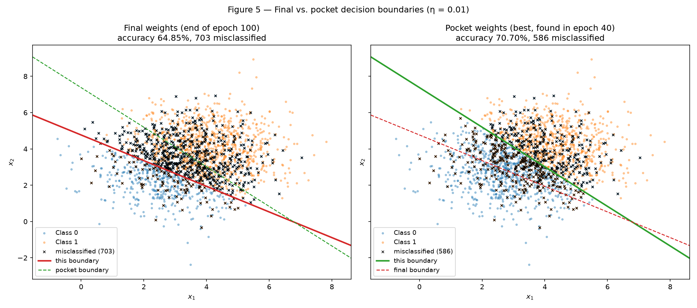
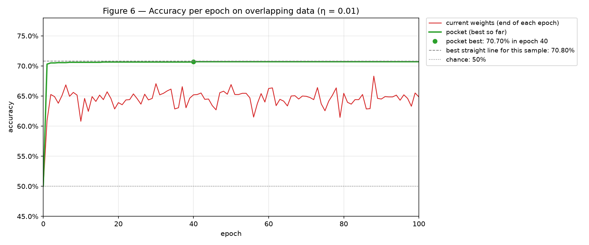

# Perceptron — Understanding Perceptrons and Their Limitations

The same single-layer perceptron, written from scratch with NumPy, is trained on two datasets: one it can solve (Exercise 1) and one it cannot (Exercise 2). No third-party model is used anywhere: the activation, the prediction, the update rule and the training loop are all in `code/perceptron.py`, and scikit-learn is not used in this activity.

**Approach.** The code is split into five files under `code/`: `perceptron.py` (the model, written once and reused unchanged by both exercises), `common.py` (data generation and plotting helpers), `exercise1.py` and `exercise2.py` (the experiments), and `main.py`, which creates the single generator `rng = np.random.default_rng(42)` and runs both exercises in sequence. Every number and figure in this report is reproduced by running, from the repository root:

```
python docs/exercises/perceptron/code/main.py
```

The generator is consumed in a fixed order: the Exercise 1 data (Class 0, Class 1, then the presentation order) and initial weights, then the same four draws for Exercise 2. Each dataset is shuffled once after generation and then kept in that order, so every epoch and every run visits the samples in exactly the same sequence.

**Challenges.**

- *Matching the update rule to the labels.* With labels in {0, 1} the rule must be driven by the error y − ŷ; the textbook form w ← w + η y x belongs to labels in {−1, +1} and would never correct a false positive.
- *Changing "nothing else" when comparing learning rates.* The η = 1.0 run of Exercise 1 must start from the same weights, and see the samples in the same order, as the η = 0.01 run. The initial weights are therefore drawn once and passed to both runs, and the presentation order is fixed.
- *The statement does not fix the presentation order*, and on non-separable data the final weights depend on it. We use the standard choice, shuffling once, and report the class-sorted order as a side check in Exercise 2, item D.
- *Knowing how good the pocket is.* The statement quotes the accuracy of the best line for its own data; for ours, the exact value is computed in item D, so the pocket can be compared against the true optimum.
- *Explaining a moving target.* On overlapping data the weights change 766 times per epoch on average. To analyse where the boundary goes, the weights after every single update are rebuilt from the training log (they are cumulative sums of η e x), without adding anything to the model.

``` python title="code/main.py"
--8<-- "docs/exercises/perceptron/code/main.py"
```

## Exercise 1

*Separable data: the case the perceptron was designed for.*

### A — Generate the data

Two classes of 2D points, 1000 samples per class, drawn with `rng.multivariate_normal`:

| Class | Mean | Covariance | Sample mean | Sample covariance |
|---|---|---|---|---|
| 0 | [1.5, 1.5] | [[0.5, 0], [0, 0.5]] | [1.450, 1.473] | [[0.491, 0.029], [0.029, 0.513]] |
| 1 | [5, 5] | [[0.5, 0], [0, 0.5]] | [5.010, 5.013] | [[0.495, 0.010], [0.010, 0.499]] |

The sample statistics match the parameters up to sampling noise. The means are 3.5·√2 ≈ 4.95 apart, seven times the standard deviation of a class (√0.5 ≈ 0.71), and this sample is exactly linearly separable: the line x₁ + x₂ = 6.5, halfway between the means, leaves all 2000 points on their correct side.


/// caption
Figure 1 — The 2000 points of Exercise 1, one color per class.
///

### B — Implement the perceptron

The perceptron is written once, in `code/perceptron.py`, as a small set of functions reused unchanged in Exercise 2:

- **Prediction:** ŷ = step(w · x + b), where step(z) = 1 if z ≥ 0 and 0 otherwise (`step`, `predict`).
- **Update rule** for labels in {0, 1}: for each sample, in the fixed order, the error e = y − ŷ is 0 on a correct prediction and ±1 on a mistake, and

    $$ \mathbf{w} \leftarrow \mathbf{w} + \eta\, e\, \mathbf{x}, \qquad b \leftarrow b + \eta\, e. $$

    A correctly classified sample changes nothing. A false negative (y = 1, ŷ = 0, e = +1) raises the sample's score w · x + b by η(‖x‖² + 1), toward the Class 1 side; a false positive (e = −1) lowers it by the same amount.
- **Initialization:** w drawn from `rng.normal(0, 0.01, size=2)` with the shared generator, and b = 0 (`init_weights`). Here w₀ = [0.009914, −0.008270], with ‖w₀‖ = 0.0129.
- **Learning rate:** η = 0.01.
- **Stopping:** training ends after the first full pass over the dataset with no update, or after 100 epochs, whichever comes first. The accuracy on the full dataset is recorded after every epoch (and before training, as epoch 0).
- **Pocket** (used in Exercise 2 only): with `pocket=True`, after every update the accuracy on the full dataset is recomputed, and (w, b) is copied into the pocket whenever it beats the best accuracy seen so far. That copy is all the option adds: the prediction, the update and the stopping rule are the same lines of code.

``` python title="code/perceptron.py"
--8<-- "docs/exercises/perceptron/code/perceptron.py"
```

### C — Train and measure

Training with η = 0.01 from w₀:

| Quantity | Value |
|---|---|
| Final w | [0.031891, 0.028736] |
| Final b | −0.2000 |
| Epochs | **2**: 48 updates in epoch 1, none in epoch 2 (the pass that confirms convergence) |
| Accuracy per epoch | 61.50% before training, 100.00% after epoch 1, 100.00% after epoch 2 |
| Final accuracy | **100.00%** (0 misclassified points) |

The epoch count includes the final pass that verifies convergence: all 48 updates happened during epoch 1, and epoch 2 was the first pass without a single mistake.


/// caption
Figure 2 — Decision boundary w · x + b = 0 after training with η = 0.01, drawn over the data. Misclassified points would be marked with a black ×; there are none.
///


/// caption
Figure 3 — Accuracy on the full dataset after each epoch (epoch 0 = initial weights), annotated with the number of updates made during the epoch.
///

### D — Analysis

**Why does separable data converge quickly?** The update rule only acts on mistakes: when ŷ = y the error is 0 and nothing changes, and every mistake moves the boundary toward classifying that sample correctly. On separable data, once the boundary lies anywhere inside the empty gap between the two clouds, no sample is misclassified, so no update ever happens again and the loop stops. The number of updates per epoch therefore drops to zero and stays there: 48 updates in epoch 1, 0 in epoch 2. The mistakes thin out even within epoch 1: 23 of the 48 happened within the first 100 samples and the other 25 in a few short bursts, the last one at the 1457th sample of 2000. None of the remaining 543 samples of epoch 1, nor any of the 2000 samples of epoch 2, was misclassified. This is what the perceptron convergence theorem guarantees for separable data: a finite number of mistakes (at most (R/γ)² when training starts from w = 0, and still finite from any other start), a number that is small when the margin γ between the classes is wide relative to the size R of the data. Here the means are seven class standard deviations apart.

**Re-run with η = 1.0, changing nothing else** (same data, same order, same w₀, b₀ = 0):

| | η = 0.01 | η = 1.0 |
|---|---|---|
| Epochs | 2 | 2 |
| Updates per epoch | 48, then 0 | 25, then 0 |
| Final accuracy | 100.00% | 100.00% |
| w | [0.031891, 0.028736] | [1.717344, 1.664585] |
| b | −0.2000 | −11.0000 |
| ‖w‖ | 0.0429 | 2.3917 |
| Direction w / ‖w‖ | [0.7429, 0.6694] | [0.7181, 0.6960] |
| Distance of the line from the origin, \|b\| / ‖w‖ | 4.659 | 4.599 |
| Distance of the closest point to the line | 0.1124 | 0.0304 |

Both runs reach 100%, but with different boundaries: their directions are 2.09° apart and they cross the gap at different places. What η controls is **how much the random start still counts** against the updates. Every update adds η e x to weights that started at ‖w₀‖ = 0.0129; with a mean ‖x‖ of 4.654, one update adds about 0.0465 at η = 0.01, only 3.6 times ‖w₀‖, but 4.654 at η = 1.0, about 360 times ‖w₀‖.

Dividing the weights by η makes this exact. The pair (w/η, b/η) follows the rule w/η ← w/η + e x, b/η ← b/η + e, which does not contain η, and it makes the same predictions as (w, b), because step(z) depends only on the sign of z. So a run with learning rate η started from w₀ makes exactly the same predictions and updates as a run with learning rate 1 started from w₀/η, whose weights are those of the first run divided by η. The code confirms it: η = 1 started from w₀/0.01 makes exactly the same 48 updates as η = 0.01 started from w₀, and its weights are exactly 100 times larger. Hence:

- at η = 0.01 the effective start w₀/η has norm 1.291, about a quarter of one update, so the random start still steers the run (48 updates) toward one particular separating line;
- at η = 1.0 the effective start has norm 0.0129, 0.3% of one update: the first update erases it and the run behaves like a zero start. It makes exactly the same 25 updates as a run started from w = 0, and its final weights differ from the zero-start ones by exactly w₀.

In other words, η does not make the perceptron learn "more carefully". Only the direction of (w, b) matters to a step activation, and a smaller η scales every update down by the same factor, so the one thing it changes is the size of the fixed starting weights relative to the updates. The two runs stop at different lines because the perceptron stops at the first line it finds that separates the data, not at a particular one: any line inside the gap is a valid stopping point, and different effective starts reach different ones.

**From w = 0, b = 0, η has no effect at all.** Take two runs started from w = 0, b = 0, with learning rates η₁ and η₂, on the same data in the same order, and let c = η₂/η₁ > 0. By induction on the number t of samples processed:

$$ \mathbf{w}^{(2)}_t = c\,\mathbf{w}^{(1)}_t, \qquad b^{(2)}_t = c\,b^{(1)}_t \qquad \text{for every } t. $$

- *Base case:* both runs start at 0, and 0 = c · 0.
- *Induction step:* for the next sample (x, y) the scores satisfy z⁽²⁾ = w⁽²⁾ · x + b⁽²⁾ = c (w⁽¹⁾ · x + b⁽¹⁾) = c z⁽¹⁾. Since c > 0, z⁽²⁾ ≥ 0 exactly when z⁽¹⁾ ≥ 0 (including z = 0, which gives ŷ = 1 in both runs), so both runs predict the same ŷ and make the same error e. Using η₂ = c η₁,

    $$ \mathbf{w}^{(2)}_{t+1} = c\,\mathbf{w}^{(1)}_t + \eta_2\, e\,\mathbf{x} = c\,\big(\mathbf{w}^{(1)}_t + \eta_1\, e\,\mathbf{x}\big) = c\,\mathbf{w}^{(1)}_{t+1}, $$

    and in the same way b⁽²⁾ₜ₊₁ = c b⁽¹⁾ₜ₊₁.

Consequently the two runs make the same mistakes on the same samples, hence the same number of updates in every epoch and the same stopping epoch, and their final parameters differ only by the factor η₂/η₁. Scaling (w, b) by c > 0 does not change the set of points where w · x + b = 0, so the decision boundary is identical: η changes nothing but the length of w. The argument breaks as soon as w₀ ≠ 0, because the base case fails (w₀ ≠ c w₀ unless c = 1). That is why item B forbids the zero start. Numerically, from the zero start both η = 0.01 and η = 1.0 make the same 25 updates at the same positions and stop after 2 epochs, with w = [0.017074, 0.016729], b = −0.11 for η = 0.01 and w = [1.707430, 1.672855], b = −11.00 for η = 1.0: exactly 100 times larger, as the proof predicts.

### Code

``` python title="code/exercise1.py"
--8<-- "docs/exercises/perceptron/code/exercise1.py"
```

``` python title="code/common.py"
--8<-- "docs/exercises/perceptron/code/common.py"
```

## Exercise 2

*Overlapping data: the case the perceptron cannot solve.*

### A — Generate the data

Two classes of 2D points, 1000 samples per class, drawn with `rng.multivariate_normal` from the same shared generator:

| Class | Mean | Covariance | Sample mean | Sample covariance |
|---|---|---|---|---|
| 0 | [3, 3] | [[1.5, 0], [0, 1.5]] | [3.072, 3.019] | [[1.472, 0.015], [0.015, 1.607]] |
| 1 | [4, 4] | [[1.5, 0], [0, 1.5]] | [3.955, 3.955] | [[1.454, −0.006], [−0.006, 1.582]] |

The means are now only √2 ≈ 1.41 apart, while each class has a standard deviation of √1.5 ≈ 1.22 in every direction: the clouds overlap heavily and no straight line separates them.


/// caption
Figure 4 — The 2000 points of Exercise 2, one color per class.
///

### B — Train, keeping the best weights

The Exercise 1 implementation is reused unchanged — the same `train` function, with η = 0.01, the 100-epoch cap, a new initial w₀ = [−0.014556, −0.004621] drawn from the shared generator and b₀ = 0 — called with `pocket=True`. The stopping condition is never met: training runs all 100 epochs and makes 76 620 updates, between 739 and 822 in every epoch.

| Weights | w | b | Accuracy |
|---|---|---|---|
| **Final** (after epoch 100) | [0.068178, 0.096455] | −0.4600 | **64.85%** |
| **Pocket** (best so far, found in epoch 40) | [0.070947, 0.065048] | −0.4800 | **70.70%** |

The pocket weights are 5.85 points better than the final weights. The statement expects the final weights to land near 50%; with our presentation order they land at 64.85%. That value depends on the order in which the samples are presented: item D explains why, and shows that the same code, with the same points presented class by class, ends at 50.05%.

### C — Figures


/// caption
Figure 5 — Final (left) and pocket (right) decision boundaries over the data. Each panel draws both lines and marks with a black × the points misclassified by its own weights: 703 for the final weights, 586 for the pocket weights.
///


/// caption
Figure 6 — Accuracy of the current weights at the end of each epoch, and best-so-far (pocket) accuracy, against the epoch. Dashed: the best straight line for this sample (70.80%). Dotted: chance (50%).
///

### D — Analysis

**The gap between the final and the pocket weights.** For this sample, the best straight line scores exactly 70.80% (1416 of 2000 points). It is computed exactly: every line thresholds a projection of the points on some direction, and rotating that direction through all the angles where two points swap order visits every possible line. The optimal classifier for these two distributions, the perpendicular bisector of the means (itself a straight line), scores 71.81% in expectation; the statement quotes about 73%, and these values vary from sample to sample. The pocket weights land 0.10 points below the best line: 70.70%, with a line passing 0.04 units from the middle of the cloud, (3.5, 3.5), and 72.90% / 68.50% of Class 0 / Class 1 correct. The final weights do not: 64.85%.

**Where the final boundary sits.** About one unit off the middle of the cloud, on the Class 0 side. The middle, (3.5, 3.5), is 0.98 units from the final line and falls on its Class 1 side, and the line classifies 75.75% of all points as Class 1: it gets 90.60% of Class 1 right but only 39.10% of Class 0 (Figure 5, left).

**Why the training loop leaves it there.** The loop does not settle the line anywhere: on overlapping data every epoch contains mistakes (at least 739), and every mistake moves the line. The hint points at how far each mistake moves it:

1. **Per mistake, b moves by η = 0.01 while w moves by η‖x‖**, 0.0511 on average (the mean ‖x‖ is 5.11): five times more.
2. **The mistakes of the two kinds almost exactly cancel.** There were 38 287 false negatives (adding η x) and 38 333 false positives (subtracting η x), so the weights never accumulate. After an update, ‖w‖ is 0.095 on average, about the size of 1.9 single updates, and it does not grow with training (0.116 at the end of the first ten epochs, 0.117 at the end of the last ten). The bias, which only records the imbalance between the two kinds (46 more false positives over the whole run, b = −46 η), is stuck as well: it stays between −0.48 and −0.40 during 90% of the updates.
3. **So one mistake shifts the line by a large amount.** The line crosses its normal direction at distance −b/‖w‖ from the origin, and to cut this cloud in the middle it has to sit about 5 units from the origin. A single mistake changes ‖w‖ by 48% (median) but b by only 2.3%, so it changes that distance by roughly half: at the middle of the cloud the line moves by 2.79 units per mistake (median), more than twice the standard deviation of a class. The bias is far too slow to hold the line in place.
4. **The final weights are wherever the last mistake of epoch 100 left the line.** With a fixed presentation order, every epoch ends the same way: in all 100 epochs, the last update was triggered by the very last sample of the order, a Class 1 point at (1.93, 3.79) that lies well inside the Class 0 region, one unit beyond the pocket line (which misclassifies it too). Its correction pulls the line toward the origin. In epoch 100 it moved the line from 1.23 units on the Class 1 side of the middle (61.75% accuracy) to 0.98 units on the Class 0 side (64.85%). That is why the line ends every epoch on the Class 0 side, between 0.69 and 1.41 units off the middle in all 100 epochs, classifying between 68.60% and 84.50% of the points as Class 1.

The pocket is immune to this, because it keeps the rare moments when the line happened to cut the cloud near its middle. The accuracy right after an update averages 60.45%; only 2.34% of the updates left it at 70% or more, and the best of them, 70.70%, is the pocket.

**The presentation order changes the snapshot, not the mechanism.** With the same points, the same w₀ and the same code, but presented class by class (all of Class 0, then all of Class 1), every epoch ends with 1000 consecutive Class 1 samples, whose corrections drag the line past the whole cloud toward the origin. The final weights then classify 99.95% of the points as Class 1 and score 50.05%, the value the statement anticipates, and the end-of-epoch accuracy never leaves the range 50.00–50.50%. The pocket still finds 67.50% (in epoch 23).

**Figure 3 vs. Figure 6: what the convergence theorem guarantees.** In Exercise 1 the accuracy curve settles: 48 updates, then none, and the loop stops at 100%. Here it never settles: the end-of-epoch accuracy wanders between 60.80% and 68.30% for all 100 epochs, and only the pocket curve flattens. The perceptron convergence theorem (Novikoff, 1962) states that if the samples are bounded, ‖(x, 1)‖ ≤ R, and **linearly separable with a margin γ > 0** — some line leaves every sample on its correct side, at a distance of at least γ in the augmented space (x, 1) — then the perceptron started from w = 0 makes at most (R/γ)² mistakes (from any other start, still a finite number), after which it classifies every training sample correctly and stops. Boundedness holds here; **linear separability is the assumption this dataset violates**. No line classifies every point correctly (the best one still misclassifies 29.20% of them), so no γ > 0 exists, and the theorem guarantees nothing: neither convergence, nor that the final iterate is any good. On a finite dataset the weights stay bounded (the perceptron cycling theorem; here ‖w‖ never exceeded 0.132 at the end of an epoch), but they keep cycling indefinitely.

**Do more epochs fix it? Does a smaller η?** Neither does, and the update rule shows why without running either experiment:

- **More epochs.** An update happens on every mistake and never shrinks: it is always η x. A pass without mistakes would mean that one fixed line classifies all 2000 points correctly, which is impossible when the best line misclassifies 29.20% of them; so the stopping condition can never be met. And since the mistakes of the two classes cancel (point 2 above), extra epochs neither make w larger nor the line steadier: they only prolong the same cycling, and with our fixed order every one of them even ends on the same sample. More epochs can only give the pocket more chances; the final weights remain a snapshot.
- **A smaller η.** The rescaling of Exercise 1 applies unchanged: (w/η, b/η) follows w/η ← w/η + e x, b/η ← b/η + e, a rule without η, and makes the same predictions as (w, b). Changing η therefore does not change the rule the boundary follows at all: the only thing it changes is the starting point of that rule, w₀/η. In particular, the ratio of the bias step to the weight step per mistake, η / (η‖x‖) = 1/‖x‖ ≈ 0.2, is the same for every η, and so is the size of a step relative to the rescaled weights, ‖x‖ / ‖w/η‖. Since the rule is the one that never stops on this data, a smaller η cannot make it converge: it only starts the same endless cycling from a different point. "Smaller steps" is an illusion when only the direction of (w, b) matters.

What does help is what the pocket does: keep the best weights instead of the last ones.

### Code

``` python title="code/exercise2.py"
--8<-- "docs/exercises/perceptron/code/exercise2.py"
```

## Results summary

| # | Quantity | Value |
|---|---|---|
| 1 | Exercise 1 — final w and b | w = [0.0319, 0.0287], b = −0.2000 |
| 2 | Exercise 1 — epochs to convergence | 2 (48 updates in epoch 1; epoch 2 was the first pass with no update) |
| 3 | Exercise 1 — final accuracy | 100.00% |
| 4 | Exercise 1 — epochs and final accuracy with η = 1.0 | 2 epochs (25 updates in epoch 1), 100.00% |
| 5 | Exercise 2 — final w and b | w = [0.0682, 0.0965], b = −0.4600 |
| 6 | Exercise 2 — accuracy of the final weights | 64.85% |
| 7 | Exercise 2 — accuracy of the pocket weights | 70.70% |
| 8 | Exercise 2 — epoch at which the pocket best occurred | 40 |
