# EDA — Stroke Prediction

**Gabriel Fernando Missaka Mendes · Eduardo Takei Yaginuma · Luca Santana Feltrin** — Insper, Artificial Neural Networks and Deep Learning, 2026.2

This report explores the dataset that the classification project will use until the end of the semester: which recorded demographic and health features are associated with a stroke, what makes the data hard, and how to turn it into an input matrix for a neural network. No model is trained here.

**Approach.** The code is split into six files under `code/`: `preprocessing.py` (the data loading, the split and the importable pipeline — nothing is fitted at import), `eda.py` (stages 1–3: inspection, univariate and bivariate analysis, Tables 2–12, Figures 1–8), `reduction.py` (stage 4: outliers, pipeline checks, PCA, t-SNE and UMAP, Tables 13–18, Figures 9–13), `common.py` (paths, colors, figure saving and result collection), `main.py`, which runs the two stages in sequence, and `check_report.py`, which verifies after a run that every table in this report is identical to the generated one and that the results summary quotes the stored numbers. Every table, number and figure in this report is reproduced, with the fixed seed `random_state=42`, by installing `requirements.txt` and running, from the repository root:

```
python docs/projects/eda/code/main.py
```

The run takes about 80 seconds on a laptop. It writes Figures 1–13 to `figures/` and, under `results/`, every table as `tableNN.csv` (NN is the table's number in this report) and in Markdown, every number quoted as JSON, and the split as `split.csv`. The CSV is committed at `data/stroke-prediction/` (SHA-256 `644d473b05d2797006bd94865e4f8bb057f0c721617911613c82c8fcfc707420`), so the script runs from a clean clone.

**Rule followed throughout.** The full file is used only for the stage-1 inventory: missing values, duplicates, consistency checks, the leakage audit and the target distribution. The split happens right after it (1D). From then on, every statistic, figure and fitted parameter comes from the 4,088 training rows. The 1,022 test rows are only transformed by the finished pipeline, to report their shape and to prove that nothing was learned from them.

**Challenges.**

- *The file is sorted by the target.* The 249 positives are its first 249 rows, so a sequential cut that keeps the last 20% as the test set would hold no positive at all. The split shuffles and stratifies.
- *Missing values that carry information.* BMI is missing five times more often among the positives. Imputing it silently would erase that signal, and dropping the rows would remove 18.6% of the training positives; the pipeline imputes and keeps an indicator.
- *Outliers that are a population.* The 503 glucose values that the 1.5×IQR rule flags are the second mode of a bimodal distribution, with a stroke rate of 13.12%. Nothing is deleted or clipped; the tails are compressed with `log1p`.
- *Categories that are age in disguise.* Marriage, work type and smoking status look like risk factors until age is held fixed. Section 3C re-tests every category within age bands, and one effect reverses.
- *Islands that are encoding geometry.* t-SNE and UMAP break the data into dozens of islands. A control run on independently shuffled columns measures how much of that structure the one-hot encoding produces on its own.

``` python title="code/main.py"
--8<-- "docs/projects/eda/code/main.py"
```

## 0. Proposal

| Item | Value |
|---|---|
| Task | Binary classification |
| Dataset | [Stroke Prediction Dataset](https://www.kaggle.com/datasets/fedesoriano/stroke-prediction-dataset) (fedesoriano, Kaggle) — public, tabular |
| Size | 5,110 rows × 12 columns: an identifier, the target and 10 predictors |
| Target | `stroke` (1 = the patient had a stroke), present in the file |
| Features | 3 numerical (`age`, `avg_glucose_level`, `bmi`) and 7 categorical (`gender`, `hypertension`, `heart_disease`, `ever_married`, `work_type`, `Residence_type`, `smoking_status`) |
| Status | Proposed by the team through the course form and approved; the same dataset carries over to the Classification deliverable |

**Motivation.** Stroke is a leading cause of death and disability, and the file mixes the kinds of inputs a clinical model meets in practice: continuous measurements on very different scales, binary clinical flags, nominal social categories and missing measurements. Preparing them for a neural network exercises every preprocessing decision of the course on a problem where getting the minority class right is what matters.

**First risk.** Only 249 of the 5,110 rows (4.87%) are positive. A model that never predicts a stroke is 95.13% accurate, so accuracy cannot be the metric, and with 199 positives in training every validation estimate will be noisy.

## 1. Initial inspection

### A — Data dictionary

**Source.** The [Stroke Prediction Dataset](https://www.kaggle.com/datasets/fedesoriano/stroke-prediction-dataset), published on Kaggle by fedesoriano as `healthcare-dataset-stroke-data.csv`. The publisher describes the source only as confidential and gives no hospital, country or collection date. **Each row is one patient**, identified by a unique `id`, with demographic information, two clinical flags, two measurements and the recorded stroke outcome. There is no date column, so the file is a snapshot: it is not known whether each measurement was taken before or after the stroke.

**Table 1 — Data dictionary.** The *semantic* type is what matters for encoding: `hypertension` and `heart_disease` are stored as integers but are yes/no flags, so they are categorical, not quantities.

| Column | Meaning | Stored as | Semantic type | Unit / values |
|---|---|---|---|---|
| `id` | Record identifier | int64 | Identifier — dropped | Arbitrary integer, 5,110 distinct values |
| `gender` | Recorded gender | text | Nominal categorical | Female, Male, Other |
| `age` | Age of the patient | float64 | Continuous numerical | Years; ages below 2 can be fractional (e.g. 0.08 ≈ 1 month) |
| `hypertension` | Has hypertension | int64 | Binary categorical | 0 = no, 1 = yes |
| `heart_disease` | Has any heart disease | int64 | Binary categorical | 0 = no, 1 = yes |
| `ever_married` | Has ever been married | text | Binary categorical | No, Yes |
| `work_type` | Type of occupation | text | Nominal categorical | children, Govt_job, Never_worked, Private, Self-employed |
| `Residence_type` | Area of residence | text | Binary categorical | Rural, Urban |
| `avg_glucose_level` | Average blood glucose level | float64 | Continuous numerical | mg/dL — not stated by the source; inferred, the 55–272 range only makes sense in mg/dL |
| `bmi` | Body mass index | float64 | Continuous numerical | kg/m²; missing values are written as the text `N/A` |
| `smoking_status` | Smoking history | text | Nominal categorical | formerly smoked, never smoked, smokes, Unknown (the publisher: "the information is unavailable for this patient") |
| `stroke` | **Target**: had a stroke | int64 | Binary categorical | 0 = no, 1 = yes |

### B — Quality

**Missing values.** Only `bmi` has empty cells: 201 of 5,110 (3.93%), stored as the text `N/A`, which pandas parses as NaN. In the training set the count is 170 of 4,088 (4.16%).

**Table 2 — Missing values per column (full file).**

| column | missing (count) | missing (%) |
|---|---|---|
| id | 0 | 0.00 |
| gender | 0 | 0.00 |
| age | 0 | 0.00 |
| hypertension | 0 | 0.00 |
| heart_disease | 0 | 0.00 |
| ever_married | 0 | 0.00 |
| work_type | 0 | 0.00 |
| Residence_type | 0 | 0.00 |
| avg_glucose_level | 0 | 0.00 |
| bmi | 201 | 3.93 |
| smoking_status | 0 | 0.00 |
| stroke | 0 | 0.00 |

**Disguised missing values.** Table 2 misses one: **`smoking_status = Unknown`**, carried by 1,544 rows (30.22% of the file) and defined by the publisher as "information unavailable". It is not random: 682 of these rows are patients under 18, and in training 498 of the 554 `children` rows are `Unknown`. Children were simply not asked, which makes the category informative rather than noise (section 4A keeps it as its own category).

**Duplicates, impossible and inconsistent values.** Every check is quantified in Table 3.

**Table 3 — Duplicates, impossible and inconsistent values (full file).**

| check | rows |
|---|---|
| Fully duplicated rows | 0 |
| Duplicated rows ignoring id | 0 |
| Repeated id | 0 |
| Constant columns | 0 |
| Values outside the documented vocabulary | 0 |
| age <= 0 or age > 120 | 0 |
| Fractional age (all below 2 years) | 115 |
| avg_glucose_level <= 0 | 0 |
| bmi < 12 (observed) | 3 |
| bmi > 60 (observed) | 13 |
| work_type = children with age >= 18 | 0 |
| ever_married = Yes with age < 18 | 0 |
| smoking_status = smokes with age < 12 | 1 |
| smoking_status = Unknown | 1544 |
| smoking_status = Unknown with age < 18 | 682 |

- No duplicates of any kind, no constant column and no value outside the documented vocabularies.
- No value violates a hard domain constraint: ages lie in (0, 82], glucose in [55.12, 271.74] and BMI in [10.3, 97.6], all positive. The 115 fractional ages are all below 2 years (maximum 1.88), so they are infants' ages in months, not errors.
- **Implausible but not impossible values** are flagged, not deleted. 13 BMIs are above 60 (maximum 97.6, then 92.0, 78.0 and 71.9). Three are below 12: a 1.24-year-old at 10.3, and two adults (40 years at 11.5, 79 years at 11.3) whose values are very likely entry errors. One 10-year-old is recorded as a current smoker, and `gender = Other` occurs once.
- **Consistent cross-column relations:** no `children` row is 18 or older (the oldest is 16), no one under 18 is married, and `Never_worked` covers ages 13–23 only.

**Leakage audit and columns to drop.** For every column, the course's question is asked: *would this value exist, exactly like this, at the moment of the prediction?*

- **`id` — dropped.** It is an identifier, not a measurement. Its Spearman correlation with the target is 0.0065 (p = 0.64), so it carries no signal. It is also unique, so there are no repeated patients to group in the split.
- **Row order leaks the target.** The 249 positives occupy rows 1–249 of the CSV, and every negative comes after them (Figure 1, right). Any split that does not shuffle — such as taking the last 20% of the file as the test set — would hold **0 positives** in the test set. Positional information (the row index, or a sequential cut) must never reach a model, and the split below shuffles.
- **The BMI missingness is suspiciously related to the target.** The stroke rate is 19.90% (40 of 201) when `bmi` is missing, against 4.26% (209 of 4,909) when it is observed (on the training rows alone, 21.76% against 4.13%, Figure 9). A plausible mechanism is that BMI was not recorded for patients admitted *because of* a stroke. If so, "BMI is missing" is partly a consequence of the label. It is kept as an indicator (4A) because the information is real in this file, but it is listed as a leakage risk with a test plan (section 5).
- **No smoking-gun feature.** No predictor comes close to the course's "correlation > 0.95 with the target" warning. The strongest single feature is `age`, with a single-feature AUC of 0.834 (Table 10), and its relation to stroke is clinically expected. Among the categorical features, the largest Cramér's V is 0.133 (Table 9).
- **Timing of the clinical flags is unknown.** `hypertension` and `heart_disease` might have been recorded after the stroke. Nothing in the file can settle this, so it is a modeling risk, not a reason to drop them.
- **No constant column** and no other identifier.

**Columns dropped:** only `id`. `stroke` is separated as the target.

### C — Target

**Table 4 — Target distribution in the full file and after the stratified split.**

| partition | rows | stroke = 0 | stroke = 1 | stroke = 1 (%) |
|---|---|---|---|---|
| Full file | 5110 | 4861 | 249 | 4.87 |
| Train | 4088 | 3889 | 199 | 4.87 |
| Test | 1022 | 972 | 50 | 4.89 |

The positive class has 249 rows (4.87%) against 4,861 negatives (95.13%), an imbalance of **19.52 negatives per positive**. Predicting "no stroke" for everyone would score 95.13% accuracy and detect no stroke at all.

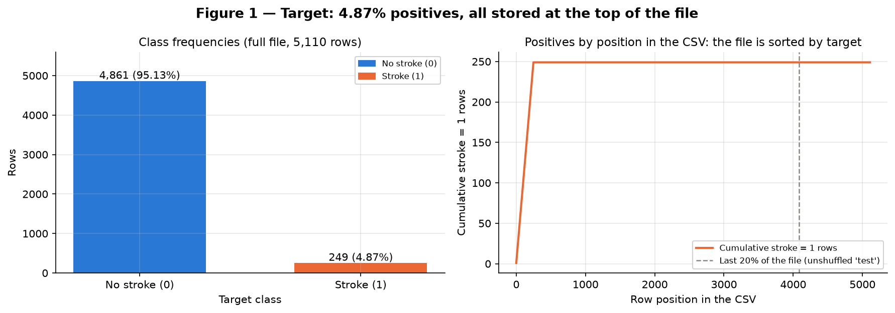
/// caption
Figure 1 — Target: class counts in the full file (left) and cumulative positives by row position (right) — the 249 positives are the first rows of the CSV.
///

**Conclusion — Figure 1.** The target is severely imbalanced (4.87% positives), and the file stores every positive in its first 249 rows. *This implies that* the split must be both stratified and shuffled, and that the modeling deliverable must be judged by minority-class metrics (average precision, recall), never by accuracy.

### D — Train and test

The split is made **before any preprocessing decision**, with `train_test_split(X, y, test_size=0.2, stratify=y, shuffle=True, random_state=42)` (function `split()` in `code/preprocessing.py`):

- **Train: 4,088 rows** (3,889 negatives, 199 positives — 4.87%).
- **Test: 1,022 rows** (972 negatives, 50 positives — 4.89%).
- The two sets are disjoint and together cover all 5,110 rows (row numbers and ids saved in `results/split.csv`, so the modeling deliverable reuses exactly this split). No row was removed before the split: the file has no duplicates to remove.
- **Stratified**, because with only 249 positives an unstratified random split would let the test rate drift by chance. Stratification fixes it at 4.87% in train and 4.89% in test (Table 4).
- **Not temporal**, because the file has no date. **Not grouped**, because each `id` is unique and there is no other patient key.
- With fewer than 10,000 rows, the course recommends cross-validation plus a held-out test set. The modeling deliverable will therefore select models with stratified, shuffled 5-fold cross-validation **inside these 4,088 training rows**, refitting the whole pipeline in every fold, and will look at the 1,022 test rows once, at the end.

**From here on, every statistic is computed on the training set only.**

## 2. Univariate analysis

### A — Numerical

**Table 5 — Descriptive statistics of the numerical features (train, observed values).**

| feature | count | missing | mean | median | std | min | Q1 | Q3 | max | skewness | excess kurtosis |
|---|---|---|---|---|---|---|---|---|---|---|---|
| age | 4088 | 0 | 43.35 | 45.00 | 22.60 | 0.08 | 26.00 | 61.00 | 82.00 | -0.16 | -0.98 |
| avg_glucose_level | 4088 | 0 | 106.32 | 91.94 | 45.26 | 55.12 | 77.31 | 114.20 | 271.74 | 1.56 | 1.62 |
| bmi | 3918 | 170 | 28.92 | 28.00 | 7.93 | 10.30 | 23.60 | 33.10 | 97.60 | 1.12 | 3.84 |

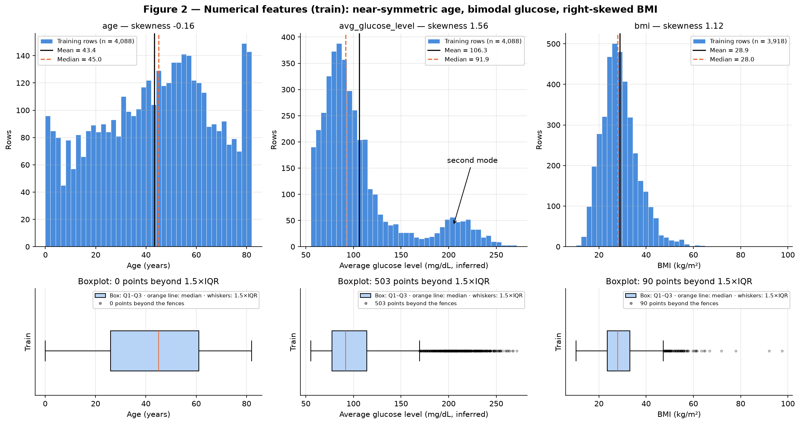
/// caption
Figure 2 — Histograms, with the mean and the median marked, and boxplots of the three numerical features; training rows only.
///

The figure shows histograms, to read the shape and the modes, with boxplots below, to count the points beyond 1.5×IQR. The mean is drawn next to the median because their gap is the cheapest skewness diagnostic.

- **`age`** — roughly uniform between 0 and 82 years, with a slight left skew (−0.16; mean 43.35 < median 45.00) and a flat shape (excess kurtosis −0.98). The two tallest 2-year bins are the last ones, 78–80 and 80–82: the oldest patients are over-represented, and none is older than 82. No point lies beyond the IQR fences.
- **`avg_glucose_level`** — strongly right-skewed (1.56; mean 106.32 > median 91.94) and, above all, **bimodal**. Located on a 10 mg/dL histogram, the main mode is near 85 mg/dL and a second mode near 205 mg/dL, separated by a valley near 175 mg/dL. 589 training rows (14.41%) lie above 150 mg/dL. The boxplot flags 503 points as "outliers", but they are not isolated errors: they are the second mode — a subpopulation, most likely diabetic patients, whose diagnosis is not a column of the file.
- **`bmi`** — right-skewed (1.12; mean 28.92 > median 28.00) with a heavy right tail (excess kurtosis 3.84). 90 points lie beyond the upper fence of 47.35, and the maximum is 97.6.

**Conclusion — Figure 2.** Age needs only rescaling. Glucose and BMI exceed the course's skewness threshold of 1, and glucose additionally mixes two populations. *This implies that* glucose and BMI need a log transform before standardization (4A), and that the 1.5×IQR rule cannot be used to delete glucose rows, since it would delete the second mode.

### B — Categorical

**Table 6 — Frequencies and cardinality of the categorical features (train).**

| feature | category | count | share (%) | cardinality | rare (< 1%) |
|---|---|---|---|---|---|
| gender | Female | 2395 | 58.59 | 3 |  |
| gender | Male | 1692 | 41.39 | 3 |  |
| gender | Other | 1 | 0.02 | 3 | yes |
| hypertension | 0 | 3691 | 90.29 | 2 |  |
| hypertension | 1 | 397 | 9.71 | 2 |  |
| heart_disease | 0 | 3867 | 94.59 | 2 |  |
| heart_disease | 1 | 221 | 5.41 | 2 |  |
| ever_married | Yes | 2700 | 66.05 | 2 |  |
| ever_married | No | 1388 | 33.95 | 2 |  |
| work_type | Private | 2332 | 57.05 | 5 |  |
| work_type | Self-employed | 667 | 16.32 | 5 |  |
| work_type | children | 554 | 13.55 | 5 |  |
| work_type | Govt_job | 522 | 12.77 | 5 |  |
| work_type | Never_worked | 13 | 0.32 | 5 | yes |
| Residence_type | Urban | 2069 | 50.61 | 2 |  |
| Residence_type | Rural | 2019 | 49.39 | 2 |  |
| smoking_status | never smoked | 1501 | 36.72 | 4 |  |
| smoking_status | Unknown | 1247 | 30.50 | 4 |  |
| smoking_status | formerly smoked | 714 | 17.47 | 4 |  |
| smoking_status | smokes | 626 | 15.31 | 4 |  |

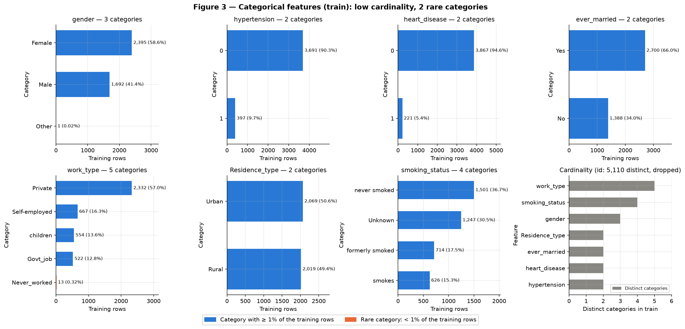
/// caption
Figure 3 — Frequency of every category in the training rows, rare categories (< 1%) in orange, and the cardinality of each feature.
///

- **Cardinality is low everywhere:** 2 to 5 categories per feature, so **no feature is high-cardinality**. The only high-cardinality column is `id` (5,110 distinct values), which is dropped.
- **Rare categories (< 1% of train):** `gender = Other`, 1 row (0.02%), and `work_type = Never_worked`, 13 rows (0.32%). A single row cannot support any conclusion about its category, and 13 rows give a stroke-rate interval of 0–22.8% (Table 8).
- **Imbalanced flags:** `hypertension = 1` (9.71%) and `heart_disease = 1` (5.41%) are minority categories, but they are not rare.
- **`smoking_status = Unknown` is the second largest category** (1,247 rows, 30.50%). Its size alone rules out dropping those rows.

**Conclusion — Figure 3.** All seven features have small, closed vocabularies, with two rare categories and one large disguised-missing category. *This implies that* one-hot encoding is cheap — 20 columns in total — and that the encoder must tolerate a category it has never seen, because a vocabulary built from one `Other` row is fragile.

## 3. Bivariate and multivariate analysis

### A — Numerical × numerical

**Table 7 — Pairwise correlations of the numerical features (train, observed values).** Each pair uses the rows where both values are observed; nothing is imputed.

| pair | n | Pearson r | Spearman ρ |
|---|---|---|---|
| age × avg_glucose_level | 4088 | 0.233 | 0.141 |
| age × bmi | 3918 | 0.336 | 0.381 |
| avg_glucose_level × bmi | 3918 | 0.172 | 0.113 |

**Method: Spearman.** Spearman ρ is the primary coefficient. Glucose is bimodal and BMI heavy-tailed (Table 5), and Pearson's r measures only linear association and is pulled by extreme points. Following the course's advice to compute both side by side, the gap between them is itself read as a diagnostic:

- **age × bmi** — ρ = 0.381 > r = 0.336. The relation is monotonic but curved: BMI rises quickly through childhood, then flattens (Figure 5, middle).
- **age × glucose** — r = 0.233 > ρ = 0.141. A group of aligned points inflates r: the second glucose mode is concentrated in older patients (median age 60 above 150 mg/dL, against 42 below).

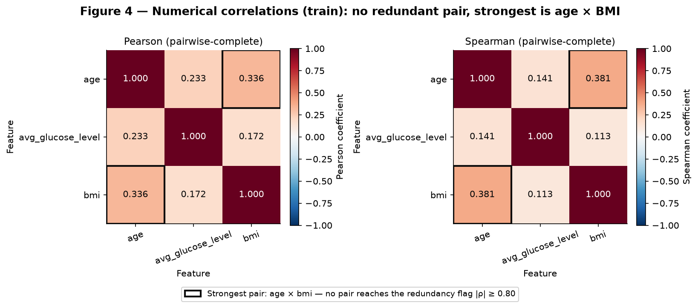
/// caption
Figure 4 — Pearson and Spearman correlation matrices of the numerical features; training rows, pairwise-complete observations.
///

**Conclusion — Figure 4.** The most correlated pair is **age × bmi, with ρ = 0.381**. No pair reaches the redundancy flag of |ρ| ≥ 0.80, so **no numerical pair is redundant**. *This implies that* all three numerical features stay, since each carries information the others do not.

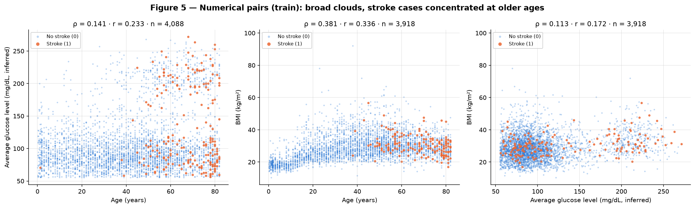
/// caption
Figure 5 — Scatter plots of the three numerical pairs, training rows, with the stroke cases drawn on top.
///

**Conclusion — Figure 5.** The age × BMI association is a **childhood growth effect**. Among adults with an observed BMI (age ≥ 18, n = 3,259), the same Spearman coefficient falls from 0.381 to 0.083: the pooled correlation is mostly confounding by age group (children against adults), the reason the course lab asks for correlations within groups as well. The plots also show where the positives sit: at older ages, in both glucose modes, with BMI near the middle of its range. *This implies that* correlations computed on the pooled data overstate the redundancy between age and BMI, and that age is the variable organizing the positives.

### B — Categorical × target

**Table 8 — Stroke rate per category (train), with 95% Wilson intervals.** The denominator is the number of rows in each category.

| feature | category | n | strokes | stroke rate (%) | 95% CI (%) |
|---|---|---|---|---|---|
| gender | Female | 2395 | 112 | 4.68 | 3.9–5.6 |
| gender | Male | 1692 | 87 | 5.14 | 4.2–6.3 |
| gender | Other | 1 | 0 | 0.00 | 0.0–79.3 |
| hypertension | 0 | 3691 | 145 | 3.93 | 3.3–4.6 |
| hypertension | 1 | 397 | 54 | 13.60 | 10.6–17.3 |
| heart_disease | 0 | 3867 | 163 | 4.22 | 3.6–4.9 |
| heart_disease | 1 | 221 | 36 | 16.29 | 12.0–21.7 |
| ever_married | No | 1388 | 23 | 1.66 | 1.1–2.5 |
| ever_married | Yes | 2700 | 176 | 6.52 | 5.6–7.5 |
| work_type | Govt_job | 522 | 28 | 5.36 | 3.7–7.6 |
| work_type | Never_worked | 13 | 0 | 0.00 | 0.0–22.8 |
| work_type | Private | 2332 | 115 | 4.93 | 4.1–5.9 |
| work_type | Self-employed | 667 | 55 | 8.25 | 6.4–10.6 |
| work_type | children | 554 | 1 | 0.18 | 0.0–1.0 |
| Residence_type | Rural | 2019 | 91 | 4.51 | 3.7–5.5 |
| Residence_type | Urban | 2069 | 108 | 5.22 | 4.3–6.3 |
| smoking_status | Unknown | 1247 | 38 | 3.05 | 2.2–4.2 |
| smoking_status | formerly smoked | 714 | 56 | 7.84 | 6.1–10.0 |
| smoking_status | never smoked | 1501 | 71 | 4.73 | 3.8–5.9 |
| smoking_status | smokes | 626 | 34 | 5.43 | 3.9–7.5 |

**Table 9 — Association of each categorical feature with the target (train).** Each row is Pearson's χ² test of independence, without Yates' continuity correction, with Cramér's V as the effect size, since with n = 4,088 a p-value alone says little.

| feature | χ² | dof | p-value | Cramér's V | min expected count | p-value, categories with expected < 5 removed |
|---|---|---|---|---|---|---|
| hypertension | 72.4 | 1 | 1.7e-17 | 0.133 | 19.33 | — |
| heart_disease | 65.8 | 1 | 5e-16 | 0.127 | 10.76 | — |
| ever_married | 46.8 | 1 | 7.9e-12 | 0.107 | 67.57 | — |
| work_type | 43.7 | 4 | 7.5e-09 | 0.103 | 0.63 | 2.6e-09 (without Never_worked) |
| smoking_status | 23.1 | 3 | 3.9e-05 | 0.075 | 30.47 | — |
| Residence_type | 1.1 | 1 | 0.29 | 0.017 | 98.28 | — |
| gender | 0.5 | 2 | 0.77 | 0.011 | 0.05 | 0.5 (without Other) |

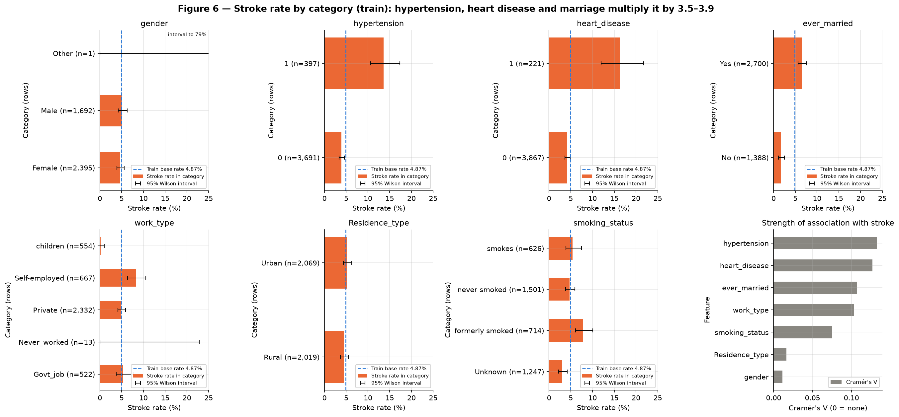
/// caption
Figure 6 — Stroke rate per category with 95% Wilson intervals against the training base rate, and Cramér's V per feature.
///

**Conclusion — Figure 6.** Five features change the stroke rate well beyond the training base rate of 4.87%:

- `heart_disease`: 16.29% when present vs 4.22% when absent (3.9×).
- `hypertension`: 13.60% vs 3.93% (3.5×).
- `ever_married`: 6.52% for Yes vs 1.66% for No (3.9×).
- `work_type`: from 0.18% for children (1 of 554) to 8.25% for Self-employed.
- `smoking_status`: from 3.05% for Unknown to 7.84% for formerly smoked.

`Residence_type` (Cramér's V 0.017, p = 0.29) and `gender` (V 0.011, p = 0.77) show no association. The χ² approximation is unreliable for `work_type` and `gender`, whose minimum expected cell counts (0.63 and 0.05) fall below the minimum of 5 set by the course's EDA handout, because of `Never_worked` and `Other`. Following the handout, the test is repeated without those categories (last column of Table 9): `work_type` stays significant (p = 2.6e-09) and `gender` stays null (p = 0.5), so the conclusions do not change. *This implies that* the clinical flags carry real signal. The social categories (marriage, work, smoking) need the age check of 3C before being read as risk factors.

### C — Numerical × categorical

**Table 10 — Numerical features by target class (train): location (median) and spread (IQR).** The single-feature AUC, equal to U / (n₁·n₀) from the Mann–Whitney test, measures how much the two classes overlap: 0.5 means no separation.

| feature | group | n | median | Q1 | Q3 | IQR | Mann–Whitney p | AUC (feature alone) |
|---|---|---|---|---|---|---|---|---|
| age | stroke = 0 | 3889 | 44.00 | 24.00 | 59.00 | 35.00 | 3.4e-57 | 0.834 |
| age | stroke = 1 | 199 | 70.00 | 58.50 | 78.00 | 19.50 | 3.4e-57 | 0.834 |
| avg_glucose_level | stroke = 0 | 3889 | 91.65 | 77.28 | 112.98 | 35.70 | 3.4e-06 | 0.597 |
| avg_glucose_level | stroke = 1 | 199 | 104.86 | 78.44 | 195.47 | 117.03 | 3.4e-06 | 0.597 |
| bmi | stroke = 0 | 3756 | 27.95 | 23.50 | 33.10 | 9.60 | 0.00027 | 0.584 |
| bmi | stroke = 1 | 162 | 29.90 | 26.52 | 33.70 | 7.18 | 0.00027 | 0.584 |

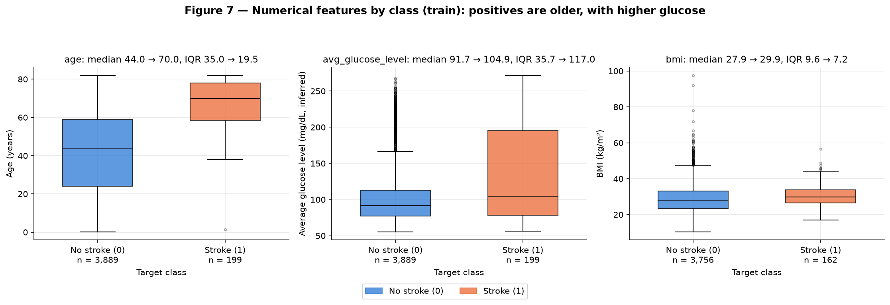
/// caption
Figure 7 — Boxplots of the numerical features by target class, training rows.
///

**Conclusion — Figure 7.**

- **Age differs in location and spread.** The median rises from 44 to 70 years, and the IQR shrinks from 35 to 19.5, since positives are concentrated in old age. 143 of the 199 training positives (71.86%) are 60 or older, and the stroke rate is 12.95% at 60+ against 1.88% below 60. Age alone reaches an AUC of 0.834.
- **Glucose differs mainly in spread.** The median rises only from 91.65 to 104.86, but the IQR more than triples, from 35.70 to 117.03, because positives populate both glucose modes (AUC 0.597). Above 150 mg/dL the stroke rate is 12.22%, against 3.63% below.
- **BMI differs only slightly in both.** The median goes from 27.95 to 29.90 and the IQR narrows from 9.60 to 7.18 (AUC 0.584).

*This implies that* no single numerical feature separates the classes. Age is the strongest signal, and glucose matters through its second mode rather than through its center.

**Table 11 — Numerical features grouped by categorical features (train).**

| feature | group | n | median | Q1 | Q3 | IQR |
|---|---|---|---|---|---|---|
| age | work_type = Govt_job | 522 | 51.00 | 41.00 | 62.00 | 21.00 |
| age | work_type = Never_worked | 13 | 17.00 | 16.00 | 18.00 | 2.00 |
| age | work_type = Private | 2332 | 45.00 | 30.00 | 59.00 | 29.00 |
| age | work_type = Self-employed | 667 | 63.00 | 50.00 | 75.00 | 25.00 |
| age | work_type = children | 554 | 6.00 | 2.00 | 11.00 | 9.00 |
| age | smoking_status = Unknown | 1247 | 24.00 | 8.00 | 52.00 | 44.00 |
| age | smoking_status = formerly smoked | 714 | 57.00 | 42.00 | 69.00 | 27.00 |
| age | smoking_status = never smoked | 1501 | 47.00 | 31.00 | 62.00 | 31.00 |
| age | smoking_status = smokes | 626 | 48.00 | 34.00 | 59.00 | 25.00 |
| avg_glucose_level | hypertension = 0 | 3691 | 91.09 | 77.03 | 112.07 | 35.04 |
| avg_glucose_level | hypertension = 1 | 397 | 103.89 | 79.79 | 196.01 | 116.22 |

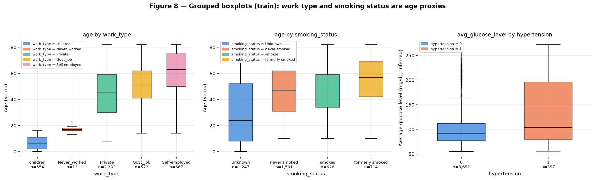
/// caption
Figure 8 — Grouped boxplots: age by work type, age by smoking status and glucose by hypertension; training rows.
///

**Conclusion — Figure 8.**

- **`work_type` is an age variable**, and the groups differ in both location and spread. Children have a median age of 6 (IQR 9) and Never_worked 17 (IQR 2). Private has 45 (IQR 29), Govt_job 51 (IQR 21) and Self-employed 63 (IQR 25), the oldest group.
- **`smoking_status` is also an age variable.** `Unknown` has the lowest median age, 24, and by far the widest spread (IQR 44), because it mixes children with adults who did not answer. `formerly smoked` is the oldest group, at a median of 57.
- **Glucose by hypertension shifts more in spread than in location.** The median goes from 91.09 to 103.89, while the IQR goes from 35.04 to 116.22: 35.52% of hypertensive patients lie above 150 mg/dL, against 12.14% of the others.

*This implies that* the categorical effects of 3B have to be re-checked with age held fixed. Table 12 does it.

**Table 12 — Stroke rate per category within age bands (train).** Rows with age ≥ 18 and age ≥ 60 are shown separately. `children` and `Never_worked` are omitted because they have no member aged 60 or more.

| feature | category | rate, all ages (%) | n, age ≥ 18 | rate, age ≥ 18 (%) | n, age ≥ 60 | rate, age ≥ 60 (%) | Fisher p, age ≥ 60 |
|---|---|---|---|---|---|---|---|
| hypertension | 0 | 3.93 | 3018 | 4.77 | 869 | 11.62 | 0.016 |
| hypertension | 1 | 13.60 | 396 | 13.64 | 235 | 17.87 | 0.016 |
| heart_disease | 0 | 4.22 | 3193 | 5.07 | 930 | 11.94 | 0.026 |
| heart_disease | 1 | 16.29 | 221 | 16.29 | 174 | 18.39 | 0.026 |
| ever_married | No | 1.66 | 714 | 3.08 | 83 | 20.48 | 0.041 |
| ever_married | Yes | 6.52 | 2700 | 6.52 | 1021 | 12.34 | 0.041 |
| work_type | Govt_job | 5.36 | 518 | 5.41 | 156 | 12.18 | — |
| work_type | Private | 4.93 | 2232 | 5.15 | 569 | 13.53 | — |
| work_type | Self-employed | 8.25 | 660 | 8.33 | 379 | 12.40 | — |
| smoking_status | Unknown | 3.05 | 700 | 5.29 | 229 | 11.35 | — |
| smoking_status | formerly smoked | 7.84 | 691 | 8.10 | 304 | 14.47 | — |
| smoking_status | never smoked | 4.73 | 1401 | 5.07 | 420 | 12.86 | — |
| smoking_status | smokes | 5.43 | 622 | 5.47 | 151 | 12.58 | — |

The age bands separate the real signals from the age proxies:

- **The clinical flags survive the control.** Among patients aged 60 or more, hypertension still raises the stroke rate from 11.62% to 17.87%, and heart disease from 11.94% to 18.39% (Fisher exact p = 0.016 and 0.026). Both gaps persist, but they are much smaller than the unadjusted 3.5–3.9×.
- **The work and smoking effects almost disappear.** At 60+, Self-employed (12.40%) is no longer above Private (13.53%). Formerly smoked (14.47%) is only slightly above never smoked (12.86%).
- **Marriage reverses.** At 60+, the never-married have the higher rate: 20.48% (17 of 83; 95% Wilson 13.2–30.4%) against 12.34% for the married (10.5–14.5%), Fisher p = 0.041. The group is small, so the reversal itself is only suggestive, but the pattern is that of a Simpson's paradox: the median age is 54 for the married and 18 for the never-married, so the unadjusted 3.9× mostly reflects the age gap, not marriage.

*This implies that* the network must see age together with the categorical features, and that none of the social categories can be presented as a risk factor.

### Code

``` python title="code/eda.py"
--8<-- "docs/projects/eda/code/eda.py"
```

``` python title="code/common.py"
--8<-- "docs/projects/eda/code/common.py"
```

## 4. Preprocessing

### A — Strategies

The pipeline is defined in `code/preprocessing.py` (shown in 4C) and fitted on the 4,088 training rows only. Each of the four strategies below cites the finding that motivates it.

**1 — Missing values.**

- **`bmi` (the only column with NaN — 3.93% of the file in Table 2, 4.16% of train): median imputation fitted on train, plus a 0/1 missing indicator.**
    - *Median*, not mean: BMI is right-skewed (skewness 1.12, mean 28.92 > median 28.00, Table 5), and the median is not pulled by the 97.6 tail. The fitted value is the **training** median, 28.0; the full-file median is 28.1.
    - *Indicator*, because the missingness is informative. Figure 9 (left) shows a stroke rate of 21.76% (37 of 170) among training rows without BMI, against 4.13% (162 of 3,918) with it. Put differently, 18.59% of the positives lack BMI against 3.42% of the negatives. Imputation alone would erase this.
    - *Dropping the rows* was rejected: it would remove 37 of the 199 training positives (18.6%).
- **`smoking_status = Unknown` (30.50% of train) is kept as a category of its own**, not imputed. It is informative (median age 24, stroke rate 3.05%, Tables 8 and 11). Imputing the mode, "never smoked", would invent a smoking history for 498 children.
- **Missing categorical values** would be filled with the constant `"missing"`. None exist in this file; the step guards the transform against empty cells in future data.

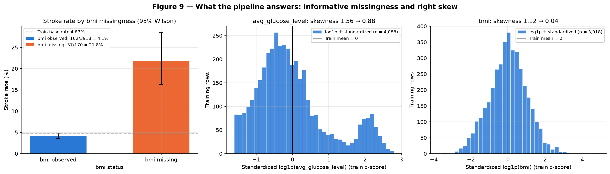
/// caption
Figure 9 — Stroke rate by BMI missingness (left) and the distributions of glucose and BMI after log1p and standardization; training rows.
///

**Conclusion — Figure 9.** BMI missingness multiplies the stroke rate by about five (left). The `log1p` transform brings BMI's skewness from 1.12 to 0.04 (right) and glucose's from 1.56 to 0.88 (middle). Glucose remains bimodal: `log1p` leaves both modes in place. *This implies that* the indicator is needed, and that the log fixes the BMI tail while the glucose second mode stays a structure the network must learn.

**2 — Outliers.**

**Table 13 — Outliers in the training set.** The fences are fitted on train; no row is removed.

| feature | lower fence | upper fence | flagged (1.5×IQR) | flagged (%) | stroke rate among flagged (%) | flagged (modified z > 3.5) |
|---|---|---|---|---|---|---|
| age | -26.50 | 113.50 | 0 | 0.00 | 0.00 | 0 |
| avg_glucose_level | 21.98 | 169.53 | 503 | 12.30 | 13.12 | 458 |
| bmi | 9.35 | 47.35 | 90 | 2.20 | 3.33 | 47 |

**Table 14 — Skewness of the right-skewed features before and after `log1p` (train, observed values).**

| feature | skewness (raw) | skewness (log1p) | max/median (raw) | max/median (log1p) |
|---|---|---|---|---|
| avg_glucose_level | 1.56 | 0.88 | 2.96 | 1.24 |
| bmi | 1.12 | 0.04 | 3.49 | 1.36 |

- **Flagged rows: 569 training rows (13.92%)** fall outside the 1.5×IQR fences on at least one feature (Table 13). The modified z-score, which the course calls the most robust detector, flags fewer: 458 glucose values and 47 BMI values.
- **Strategy: no row is removed and no value is clipped. The tails are compressed by `log1p` instead.**
- *Glucose flags are not outliers.* The 503 flagged glucose values are the second mode (Figure 2), and their stroke rate is 13.12%. Deleting the 569 flagged rows would delete 66 of the 199 training positives (33.2%).
- *Nothing qualifies for removal.* The course's quality page reserves removal for a clear error that cannot be fixed, affecting few enough rows that losing them costs nothing. No value breaks a hard domain constraint (Table 3), and the 13 BMIs above 60 are extreme but possible. The two adult BMIs below 12 are probably entry errors but cannot be proven so; after `log1p` and standardization they sit near z = −3.4 (Table 15), inside the range of the other inputs. They are kept, documented in Table 3, and covered by a sensitivity check in section 5.
- *Why the log is enough for a neural network.* Plain standardization (after the same median imputation) would put BMI 97.6 at z = 8.85, a single input able to dominate a gradient step. After `log1p` and standardization, the largest training |z| values are 1.92 (age), 2.80 (glucose) and 4.87 (BMI). The log also cuts BMI's max/median ratio from 3.49 to 1.36 (Table 14).

**3 — Categorical encoding.**

- **One-hot encoding for all 7 categorical features**, the two integer flags included. They have only 2–5 categories each (Table 6), which is far below the 20–50 categories up to which the course calls one-hot "the honest choice". Their categories have no order, so an ordinal code would invent comparisons.
- **Full one-hot, no dropped level.** The same matrix feeds the distance-based projections of 4B. Dropping a level, as `drop="first"` does, would place the dropped category closer to every other one, as the course lab shows. A neural network is not hurt by the redundant column.
- **Rare categories are kept as they are.** The course's normalization handout recommends grouping rare levels only for features with 10–50 levels ("below 10 levels, one-hot is fine"); here every feature has at most 5. Grouping would also only rename the two rare categories, since each feature has just one: the single `Other` row for `gender` and the 13 `Never_worked` rows for `work_type`.
- **A category that is new in the test set** is encoded as an all-zero block (`handle_unknown="ignore"`), never as a known category. The real test set happens to contain no unseen category; the behavior is therefore verified with a probe (4C).

**4 — Scaling.**

- **The raw scales differ by an order of magnitude** (Table 5): age spans 0.08–82 (std 22.60), glucose 55.12–271.74 (std 45.26) and BMI 10.3–97.6 (std 7.93), while every one-hot column is 0/1. A gradient-trained network needs comparable input scales, or the largest one dominates the first-layer updates.
- **Standardization.** `StandardScaler` (mean 0, standard deviation 1, fitted on train) is applied after `log1p` for glucose and BMI — the course's rule "log1p first, then standardize" for skewness > 1 — and directly to age (skewness −0.16).
- **Min-max scaling was rejected.** BMI's range is set by the single 97.6 value, so its whole IQR would be squeezed into 0.152–0.261 of the [0, 1] interval.
- **A robust scaler is unnecessary.** After the log, the remaining tails are mild (largest |z| = 4.87).
- **The 0/1 columns** (one-hot and the missing indicator) are not rescaled; their values are already on the scale of standardized inputs.

**Table 15 — Parameters fitted by the pipeline (training rows only).**

| feature | imputation median | scaler mean | scaler std |
|---|---|---|---|
| age | 45.000 | 43.3533 | 22.5941 |
| log1p(avg_glucose_level) | 91.945 | 4.6048 | 0.3587 |
| log1p(bmi) | 28.000 | 3.3655 | 0.2515 |

### B — Dimensionality reduction

The three projections all use the same matrix: the 4,088 training rows transformed by the pipeline (24 columns: 3 scaled numerical, 1 indicator, 20 one-hot). The target is never an input; it only colors the points. At this size no sampling is needed — each t-SNE or UMAP fit takes seconds.

**PCA.**

- **Variance.** Fitted with all 24 components. The total variance is 6.08: 3.00 from the three standardized numerical columns, the rest from 0/1 columns, each holding at most p(1−p) ≤ 0.25. **7 components have zero variance**, one per categorical feature, because each full one-hot block always sums to 1. So only 17 directions carry information.
- **PC1 explains 30.80% and PC2 15.20%, so PC1 + PC2 = 46.00%.** Reaching 80% takes 7 components, 90% takes 10, and 95% takes 12 (Table 16). A 2D picture therefore hides more than half of the variance.

**Table 16 — PCA explained variance (first 8 of 24 components).**

| component | explained (%) | cumulative (%) |
|---|---|---|
| PC1 | 30.80 | 30.80 |
| PC2 | 15.20 | 46.00 |
| PC3 | 10.91 | 56.91 |
| PC4 | 8.21 | 65.13 |
| PC5 | 8.03 | 73.15 |
| PC6 | 5.35 | 78.51 |
| PC7 | 4.74 | 83.24 |
| PC8 | 3.26 | 86.51 |

**Table 17 — Largest PCA loadings (eigenvector coefficients) of PC1 and PC2.** Only the relative signs within a component are read; the overall sign of a component is arbitrary.

| feature | PC1 | PC2 |
|---|---|---|
| log__avg_glucose_level | +0.303 | +0.940 |
| num__age | +0.626 | -0.139 |
| log__bmi | +0.541 | -0.215 |
| cat__ever_married_No | -0.256 | +0.088 |
| cat__ever_married_Yes | +0.256 | -0.088 |
| cat__work_type_children | -0.181 | +0.090 |
| cat__smoking_status_Unknown | -0.161 | +0.071 |
| cat__work_type_Private | +0.084 | -0.062 |
| cat__gender_Female | +0.014 | -0.084 |
| cat__gender_Male | -0.013 | +0.083 |

- **PC1 is a "life-stage" axis.** It loads positively on age (+0.626), BMI (+0.541), glucose (+0.303) and ever_married = Yes (+0.256), and negatively on ever_married = No (−0.256), work_type = children (−0.181) and smoking = Unknown (−0.161). Its scores correlate 0.858 with standardized age and 0.740 with BMI. One end holds children with unknown smoking status, the other older, heavier, married adults.
- **PC2 is a "glucose" axis.** It is dominated by glucose (+0.940), with age (−0.139) and BMI (−0.215) in contrast, and its scores correlate 0.904 with standardized glucose. It separates the second glucose mode from the first.

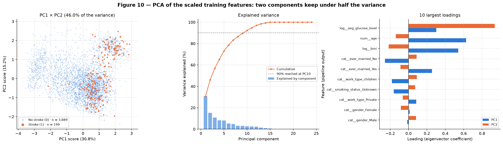
/// caption
Figure 10 — PCA of the transformed training matrix: scores colored by the target, explained variance by component and the ten largest loadings.
///

**Conclusion — Figure 10.** The positives sit at high PC1 (older patients) and spread along PC2 across both glucose modes, inside a cloud of negatives. *This implies that* the target is not linearly separable in the two directions of largest variance. A linear 2D summary would be a poor input for the classifier.

**t-SNE and UMAP.** The statement asks for at least two values of each parameter; the course's reduction handout recommends at least three across the usual 5–50 range, so each method is fitted three times:

- **t-SNE:** perplexity 5, 30 and 50 (`init="pca"`, `learning_rate="auto"`, `random_state=42`). The final KL divergences are 0.971, 1.017 and 1.059.
- **UMAP:** n_neighbors 5, 15 and 50 (`min_dist=0.1`, `random_state=42`).

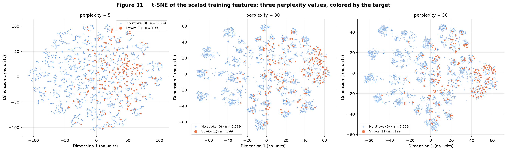
/// caption
Figure 11 — t-SNE of the transformed training matrix at perplexity 5, 30 and 50, colored by the target.
///

**Conclusion — Figure 11.** At every perplexity, t-SNE breaks the data into dozens of small islands. Perplexity 5 fragments them into short filaments, and 50 merges neighbors into larger groups. The positives are scattered over many islands, denser on one side of the map, with no island of their own. *This implies that* the local structure is real and stable across perplexities (Table 18), but it is not a stroke/no-stroke structure.

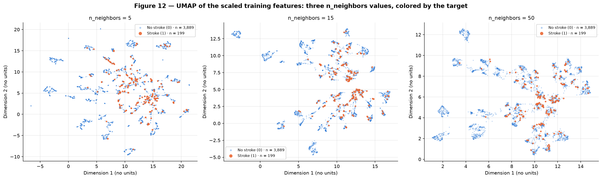
/// caption
Figure 12 — UMAP of the transformed training matrix at n_neighbors 5, 15 and 50, colored by the target.
///

**Conclusion — Figure 12.** UMAP shows the same picture: with 5 neighbors the graph splits into many disconnected pieces, and with 50 the islands gather into fewer groups. The positives again mix with negatives inside the islands. *This implies that* the absence of a class cluster is not an artifact of one method or one parameter.

**What the nonlinear projections reveal that PCA does not.** Figure 13 colors the same maps by `work_type` and by age, and Table 18 measures them.

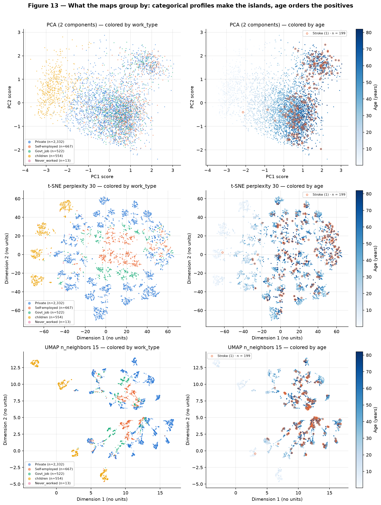
/// caption
Figure 13 — PCA, t-SNE and UMAP colored by work type (top) and by age, with the stroke cases circled (bottom).
///

**Conclusion — Figure 13.** Colored by `work_type` (top), the t-SNE and UMAP islands are homogeneous blocks of categories — children form islands of their own — while PCA mixes every category in one cloud. Colored by age (bottom), every map shows the positives on the oldest points, whatever the island. *This implies that* the nonlinear maps are organized by the categorical profiles while the risk follows age across them, so the islands are not stroke subtypes.

**Table 18 — Projection diagnostics (train, 4,088 rows; base rate 4.87%).** Trustworthiness measures how well each map keeps the original neighbors (k = 5 and k = 30). The last two columns count, among each point's 10 nearest neighbors in the map, the share that are positive (computed around the positives only) and the share with exactly the same categorical profile — the 7 categorical features plus the BMI indicator.

| space | trustworthiness k=5 | trustworthiness k=30 | positives among 10-NN of positives (%) | same categorical profile among 10-NN (%) |
|---|---|---|---|---|
| Original 24 dimensions | — | — | 8.89 | 75.5 |
| PCA (2 components) | 0.817 | 0.820 | 8.84 | 4.5 |
| t-SNE perplexity 5 | 0.996 | 0.954 | 10.20 | 78.2 |
| t-SNE perplexity 30 | 0.997 | 0.977 | 9.70 | 77.7 |
| t-SNE perplexity 50 | 0.996 | 0.978 | 10.20 | 76.7 |
| UMAP n_neighbors 5 | 0.994 | 0.956 | 10.65 | 76.9 |
| UMAP n_neighbors 15 | 0.987 | 0.969 | 9.05 | 74.2 |
| UMAP n_neighbors 50 | 0.981 | 0.971 | 10.50 | 68.2 |
| Control: t-SNE perplexity 30 on independently shuffled columns | 0.992 | 0.944 | 3.97 | 59.7 |

- **The islands are categorical profiles.** The training set holds 364 distinct combinations of the seven categorical features plus the BMI indicator. In the original 24-dimensional space, 75.5% of each point's 10 nearest neighbors share its exact profile. t-SNE (76.7–78.2%) and UMAP (68.2–76.9%) keep that level, but PCA keeps only **4.5%**: it superimposes the profiles, because its two components are spent on the three continuous features. In Figure 13 (top), the `children` profiles form islands of their own in t-SNE and UMAP, while PCA only shades them along PC1.
- **Part of the island structure is encoding geometry — the null control shows how much.** The course's reduction handout recommends rerunning the method on independently shuffled columns. With every raw column permuted separately (no association left between features or with the target), t-SNE at perplexity 30 still keeps 59.7% profile agreement over 440 profiles (Table 18, last row). Full one-hot vectors of different profiles always sit √2 apart per differing feature, so islands form even in pure noise. The real data reach 77.7% with 364 profiles: the excess comes from real associations between the categorical features, such as children with unknown smoking status and no marriage.
- **The local structure is far better preserved.** At k = 5, trustworthiness is 0.996–0.997 for t-SNE and 0.981–0.994 for UMAP, against 0.817 for PCA. Comparing the two neighborhood sizes ("read the columns, not the rows"): t-SNE with perplexity 5 drops from 0.996 at k = 5 to 0.954 at k = 30, because it keeps only the closest neighbors, while perplexity 50 drops less, to 0.978.
- **The positives are not a cluster in any space.** Around each positive, 8.89% of its 10 nearest neighbors are positive in the original space: 1.8 times the base rate, but far from a pure group. The 2D maps stay in the same range (8.84–10.65%), and none forms a positive cluster. In the shuffled control the share falls to 3.97%, below the 4.87% base rate, so the enrichment in the real maps is signal (age), not an artifact of the method. Figure 13 (bottom) shows why the enrichment exists at all: in the islands that contain positives, they sit at the old-age end.

**Comparison.** PCA gives a global, linear and interpretable view: two axes (life stage, glucose), measurable variance, and loadings that can be read. t-SNE and UMAP reveal what PCA flattens: the data are a mosaic of categorical profiles, and age orders the risk inside each one. Within the course's rules — no reading of island sizes or of distances between islands, and conclusions only from patterns stable across all three parameter values — the three methods agree: **no 2D view separates the classes**. *This implies that* the classifier must use the full 24-column matrix and combine age with the clinical flags and glucose. t-SNE coordinates cannot be features in any case: t-SNE cannot transform new rows, so it cannot be refitted inside cross-validation.

### C — Pipeline

`code/preprocessing.py` is importable: nothing is fitted at import. It exposes `load_raw()`, `split()` and `build_preprocessor()`, which returns an **unfitted** `ColumnTransformer` with four branches: `num` (age), `log` (glucose, BMI), `missing` (BMI indicator) and `cat` (one-hot). The analysis calls `fit_transform(X_train)` once and `transform(X_test)` once:

``` python title="code/preprocessing.py"
--8<-- "docs/projects/eda/code/preprocessing.py"
```

**Checks of the fitted pipeline** (computed in `code/reduction.py`):

| Check | Result |
|---|---|
| Shape after the pipeline | **train (4088, 24), test (1022, 24)** |
| NaN after the pipeline | **0 in train, 0 in test** (and 0 infinite values) |
| Fitted only on train | imputation medians are the training medians (BMI 28.0 vs full-file 28.1; glucose 91.945 vs 91.885) |
| Proof that the test set was not used | scaled numerical columns have mean exactly 0 and std 1 on train, but means −0.028 / −0.023 / −0.011 and stds 1.003 / 0.999 / 0.979 on test |
| New category | a probe row with `gender = "Nonbinary"` and `work_type = "Freelancer"` gives all-zero `gender` and `work_type` blocks and a finite row of width 24 |
| All-missing row | a row with every value missing is still finite, with the BMI indicator set to 1 |

**Feature names, in output order (24):**

| # | Feature | # | Feature |
|---|---|---|---|
| 1 | `num__age` | 13 | `cat__ever_married_Yes` |
| 2 | `log__avg_glucose_level` | 14 | `cat__work_type_Govt_job` |
| 3 | `log__bmi` | 15 | `cat__work_type_Never_worked` |
| 4 | `missing__missingindicator_bmi` | 16 | `cat__work_type_Private` |
| 5 | `cat__gender_Female` | 17 | `cat__work_type_Self-employed` |
| 6 | `cat__gender_Male` | 18 | `cat__work_type_children` |
| 7 | `cat__gender_Other` | 19 | `cat__Residence_type_Rural` |
| 8 | `cat__hypertension_0` | 20 | `cat__Residence_type_Urban` |
| 9 | `cat__hypertension_1` | 21 | `cat__smoking_status_Unknown` |
| 10 | `cat__heart_disease_0` | 22 | `cat__smoking_status_formerly smoked` |
| 11 | `cat__heart_disease_1` | 23 | `cat__smoking_status_never smoked` |
| 12 | `cat__ever_married_No` | 24 | `cat__smoking_status_smokes` |

### Code

``` python title="code/reduction.py"
--8<-- "docs/projects/eda/code/reduction.py"
```

``` python title="code/check_report.py"
--8<-- "docs/projects/eda/code/check_report.py"
```

## 5. Synthesis

*Written for whoever builds the classifier.*

**Main findings.**

1. **Severe imbalance:** 4.87% positives, 19.52 negatives per positive, and only 199 positives in training (Table 4, Figure 1).
2. **The CSV is sorted by the target.** All 249 positives come first, so a sequential cut with the last 20% as the test set gives 0 positives (Figure 1).
3. **Age is the dominant signal.** It has a single-feature AUC of 0.834, and 71.86% of the positives are 60 or older (Table 10, Figure 7). It also places the positives inside the projection islands that contain them (Figure 13).
4. **Glucose is bimodal.** 14.41% of the patients are above 150 mg/dL, with a stroke rate of 12.22% against 3.63% below. The variable that splits the two modes, probably diabetes, is not in the file (Figure 2, section 3C).
5. **Hypertension and heart disease are real risk markers.** They survive age stratification, though weaker: 17.87% vs 11.62% and 18.39% vs 11.94% at 60+ (Table 12).
6. **Marriage, work type and smoking status are age proxies.** Their unadjusted effects vanish or reverse within age bands (Tables 11–12, Figure 8).
7. **BMI missingness is informative:** 21.76% stroke rate among missing values vs 4.13% among observed (Figure 9).
8. **No redundant numerical pair.** The strongest is age × BMI, with ρ = 0.381, which falls to 0.083 among adults aged 18 or more (Table 7, Figure 5).
9. **The geometry is a mosaic of 364 categorical profiles.** No 2D projection separates the classes (Table 18, Figures 10–13).

**Risks for modeling, each with a handling plan.**

| Risk | Evidence | Plan |
|---|---|---|
| Imbalance and a small positive class | 199 training positives, 4.87% (Table 4) | Report **average precision** next to the 4.87% prevalence, with recall, precision and the confusion matrix — never accuracy. Choose the decision threshold on validation folds. Use class weights (`pos_weight` ≈ 3,889 / 199 ≈ 19.5) fitted inside the training folds only. Report the cross-validation mean ± sd, since few positives make every estimate noisy |
| Order leakage | Positives in rows 1–249 (Figure 1) | Always shuffle: `StratifiedKFold(n_splits=5, shuffle=True, random_state=42)`. Never use the row index |
| Preprocessing leakage | Every parameter fitted (Table 15) | Put `build_preprocessor()` inside an sklearn `Pipeline` with the model and refit it in every fold. Look at the test set once, at the end |
| BMI missingness may be a consequence of the label | 21.76% vs 4.13% (Figure 9) | Train with and without the missing indicator. If the indicator carries the gain, treat it as a collection artifact and prefer the model without it, unless BMI is known to be recorded before the prediction |
| Age confounding | Tables 11–12 | Keep every feature. Do not read social categories as risk factors. Report recall per age band (< 60 / ≥ 60) |
| Hidden variable behind glucose | Second mode (Figure 2) | Keep glucose continuous after `log1p`. Optionally test a "second mode" flag, with its threshold (valley near 175 mg/dL) chosen inside the training folds |
| Implausible values and rare categories | 13 BMIs > 60, 2 adult BMIs < 12, `Other` (1 row), `Never_worked` (13) (Tables 3, 6) | Keep them; run a sensitivity check that sets the 2 adult BMIs below 12 to missing (so the imputer and the indicator handle them) and compare the validation scores. Unseen categories already map to all-zero blocks |
| Unknown provenance and timing | Section 1A | Present the model as a classifier of the recorded label, not as a validated prospective risk predictor |

**Reproducibility.** The code runs from a clean clone (`pip install -r requirements.txt`, then `python docs/projects/eda/code/main.py`). Every table and figure comes from that run, and every number quoted is either stored in `results/` or simple arithmetic on those values (ratios such as 1.8× or 19.5); `python docs/projects/eda/code/check_report.py` then confirms that the 17 tables embedded here equal the generated ones and that the results summary carries the stored numbers. The run recorded here used Python 3.14.3, numpy 2.5.2, pandas 3.0.5, scipy 1.18.1, scikit-learn 1.9.0, umap-learn 0.5.12 and matplotlib 3.11.1 (saved in `results/reduction_metrics.json`). A rerun from a fresh clone reproduced every file in `results/` byte for byte; other library versions may move the t-SNE and UMAP coordinates.

## Results summary

| # | Results summary | Value |
|---|---|---|
| 1 | Dataset, task and target | Stroke Prediction Dataset (fedesoriano, Kaggle) · binary classification · target `stroke` (1 = had a stroke) |
| 2 | Instances × features (numerical / categorical) | 5,110 × 10 predictors (3 numerical / 7 categorical); 12 columns in the file, counting `id` and the target |
| 3 | Column with the most missing values and its percentage | `bmi`: 201 missing, 3.93% of the file (170, 4.16% of train) |
| 4 | Dropped columns and the reason | `id` — an identifier, no signal (Spearman 0.0065 with the target); no constant or leaking predictor dropped |
| 5 | Minority class (%) · or mean and median of the target | `stroke = 1`: 249 of 5,110 = 4.87% (19.52 negatives per positive) |
| 6 | Size of the training and test sets | Train 4,088 (199 positives) · test 1,022 (50 positives); stratified 80/20, `random_state=42` |
| 7 | Most correlated numerical pair and its value | age × bmi, Spearman ρ = 0.381 (Pearson r = 0.336); 0.083 among adults aged 18 or more |
| 8 | Rows affected by the outlier strategy | 569 training rows (13.92%) flagged by 1.5×IQR; 0 removed, 0 clipped; their glucose/BMI tails compressed by `log1p` (largest BMI z, median-imputed: 8.85 → 4.87) |
| 9 | Variance explained by PC1 + PC2 | 46.00% (PC1 30.80% + PC2 15.20%) |
| 10 | shape of train and test after the pipeline | train (4088, 24) · test (1022, 24); 0 NaN |
